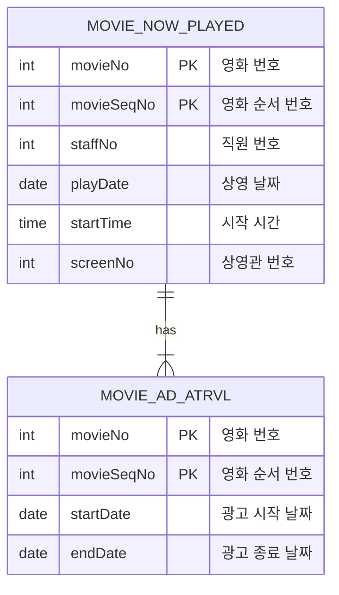
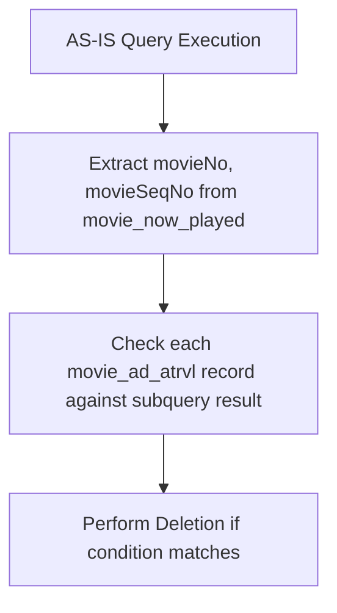
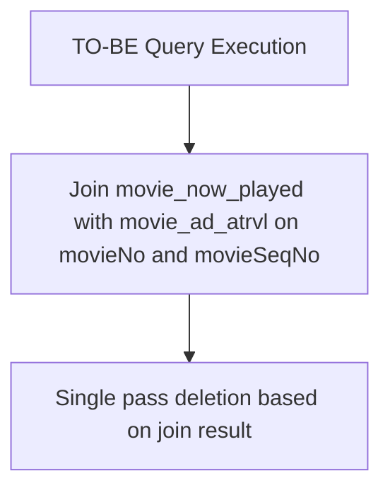

### 예제 테이블
---



위와 같은 테이블이 존재하고.

#### AS-IS

특정 영화에 특정 상영 회차에 해당하는 광고 속성 정보를 제거한다고 가정하자.

```Mysql
delete
from movie_ad_atrvl
where (movieNo, movieSeqNo) in
(select mp.movieNo, mp.movieSeqNo 
from movie_now_played mp
where mp.movieNo = '12345678'
and mp.screenNo = '23456');
```





AS-IS 쿼리에서 사용된 `IN` 절은 `movie_now_played` 테이블에서 `movieNo`와 `movieSeqNo`를 선택하여, 해당 결과를 `movie_ad_atrvl` 테이블에서 삭제.

MYSQL 실행 계획 내에서 Delete 쿼리에 서브쿼리 사용시 `DEPENDENT SUBQUERY`로 풀리며, 각 레코드에 대한 서브쿼리 결과를 확인하므로 매우 비효율적일 수 있음. 

각 삭제 작업마다 서브쿼리를 다시 평가해야 하기 때문에 성능 저하가 발생.

MYSQL 5.7 특성상 발생하고 쿼리 변경으로 개선이 가능하다.
#### TO-BE

```Mysql
delete a.*
from movie_ad_atrvl a
join (select movieNo, movieSeqNo
	 from movie_now_played
	 where movieNo = '12345678' and
	 mp.screenNo = '23456') as mp
	 on a.movieNo = mp.movieNo and
	 a.movieSeqNo = mp.movieSeqNo;
```


TO-BE 쿼리는 `JOIN`을 사용하여 `movie_now_played` 테이블의 결과와 `movie_ad_atrvl` 테이블을 직접 연결하고, 이를 통해 삭제를 수행.

`JOIN`은 서브쿼리를 한 번만 평가하고 결과를 메모리 내에서 관리하여 처리 속도가 향상.

이러한 방식은 효율적인 인덱스 활용을 가능하게 하여 전체적인 성능을 개선할 수 있음.