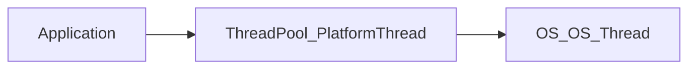

#### Virtual Thread?
---

> [!info]
> JDK 21(LTS)에 추가된 경량 스레드
> OS 스레드를 그대로 사용하지 않고 JVM 내부 스케줄링을 통해서 
> 수십 ~ 수백만개의 스레드를 동시에 사용 할 수 있게 한다.

#### 탄생 배경
---

Java의 Thread는 OS Thread를 Wrapping 한것 (Platform Thread)

Java 애플리케이션에서 Thread를 사용하면 실제로 OS Thread를 사용한 것

OS Thread는 생성 갯수가 제한적이고, 생성 유지하는 비용이 비싸다.

(무한히 늘릴 수 없음)

이 때문에 애플리케이션에서는 platform thread를 효율적으로 사용하기 위해 ThreadPool을 사용한다.



이러다 보니까

Throughput에 제한이 좀 생김.

Thread per Request 즉 하나의 요청에 하나의 스레드

처리량을 높이려면 스레드 증가가 필요, but 스레드를 무한정 늘릴 수가 없음 (OS 스레드 제약)

Throughput을 늘릴 수 있는 대안이 scale out을 할 수 있음.

높은 트래픽이나 높은 Throughput을처리 하려면 대안이 필요함.

추가적으로

Blocking IO 이슈 가 존재함

즉 작업 처리 시간보다 Blocking 에서 wait time이 존재하기 때문에 thread를 효율적으로 사용할 수가 없음.

#### Webflux
---

Reactive Programming이 생겨남.

WebFlux 스레드를 대기하지않고 다른 작업 처리가 가능함.
코드를 작성하고 이해하는 비용이 높음 즉 러닝 커브가 존재함.
디버깅이 쉽지 않음.
Reactive하게 동작하는 라이브러리의 지원을 필요로함
No JPA -> R2DBC 비동기 디비호출도 지원해줘야함.
Reactor MeltDown 

1. https://blog.jdriven.com/2020/10/spring-webflux-reactor-meltdown-slow-responses/
2. https://www.youtube.com/watch?v=I0zMm6wIbRI 내가 만든 webflux가 느렸던 이유

flatMap 부터 많이 해맴.

동기식으로 짜던 코드에서 Reactive 코드를 짜는게 어려움.

#### Java의 Design
---

Exception Stack Trace, Debugger, Profiling 등 모드 스레드 기반.

Reactive 작업시 여러 스레드를 거쳐서 작업이 처리됨.

context 확인이 어려워 디버깅이 어려움.

Throughput을 늘릴 수는 있는데 실 개발 시간은 길어지는 사이드 이펙트가 존재할 수 있음.

#### 해결하고자 하는 문제가 무엇일까?
---
일단 Throughput를 높이자.

즉 높은 처리량을 확보.

Blocking 발생시 내부 스케줄링을 통해서 다른 작업을 처리 하자.

자바 플랫폼의 디자인과 조화를 이루는 코드를 생성해보자
즉 기존 스레드 구조 그대로 사용하자.

디버깅이 어렵다던가 코드작성이 어려운것을 좀 잘 해결해보자.

```java

package java.lang;

sealed abstract class BaseVirtualThread extends Thread permits VirtualThread, ThreadBuilders.BoundVirtualThread {

}
```

Thread를 extend 하고 있기 때문에 Thread에서 사용하던 메서드를 그대로 사용할 수 있음.

즉 처리량은 Reactive 스타일의 처리량을 갖으면서 이해도는 mvc 스타일로 가져갈 수 있다.

#### Platform Thread
---

