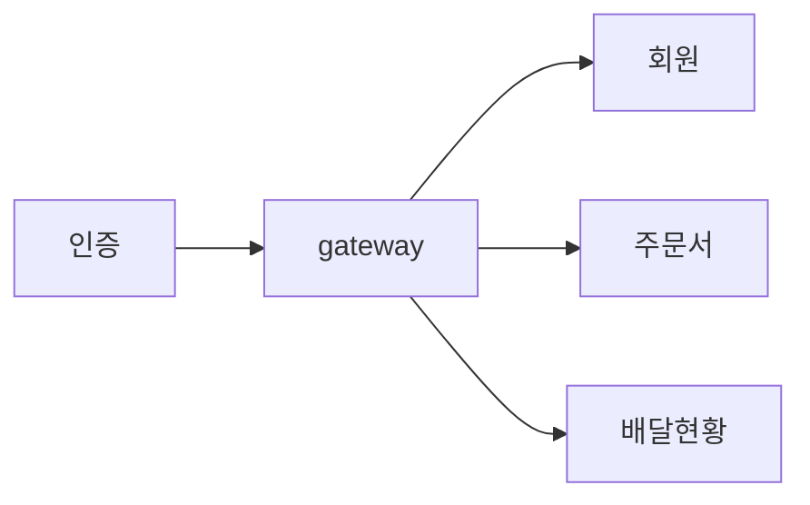
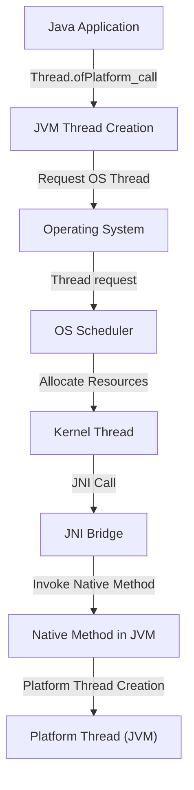
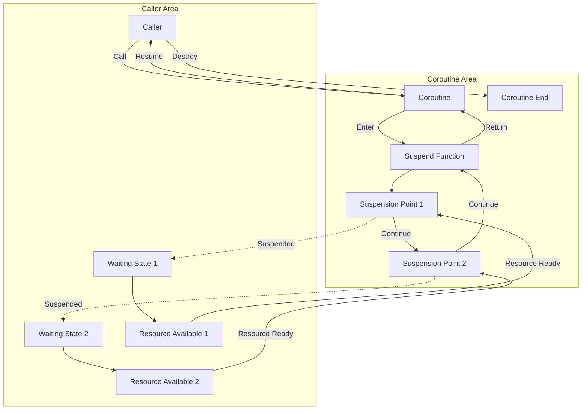

>우아한 테크 세미나 정리.

> 무조건 좋은 기술은 아니다.
> 어떤 장점을 갖고 있고
> 어떻게 구현이 되어있으며
> 어떤 상황에서 사용하면 좋을지.
> 상황과 필요에 맞게.

### 서론 고민
---

배민의 경우

전사보급형 게이트웨이 개발

안정성과 처리량 고민



1. kotlin Coroutine
2. Java Project Loom

### Virtual Thread 소개
---

2018년 Project Loom 으로 시작된 경량 스레드 모델
2023 JDK 21에 정식 Feature로 추가

1. 스레드 생성 및 스케줄링 비용이 기존 스레드보다 저렴
2. 스레드 스케줄링을 통해 Nonblocking I/O 지원
3. 기존 스레드를 상속하여 코드 호환

#### 스레드 생성 비용이 저렴하다
---

>기존에는 그럼 생성비용이 저렴하지 않았나?

1. 스레드 풀의 존재 이유 만으로 스레드 생성 비용이 큰것을 나타냄.
   미리 여러개의 스레드를 만들어 두고 요청이 올떄 마다 사용하기 위함.

2. 사용 메모리 크기가 큼.
   Java Thread는 최대 2mb 까지 사용하면서 많은 메모리 사용

3. OS에 의해서 스케줄링이 됨.
   스레드 스케줄링 과정에서 os와 통신해야 하기 때문에 시스템 콜이 발생함.
   Java에서 커널영역 호출시 활용되는 인터페이스
   시스템콜 오버헤드가 존재함.

Virtual Thread는?
1. Thread Pool 이 존재하지 않음
   요청마다 생성하고 요청마다 파괴하는 방식.

2. 사용 메모리 크기가 작다.
   수십 kb 까지만 사용되도록 설계됨.

3. OS가 아닌 JVM 내에서 스케줄링 되도록 설계됨
   시스템콜 오버헤드가 존재하지 않음.

| 기준              | Thread                               | Virtual Thread                | 비고                                                                                                       |
| --------------- | ------------------------------------ | ----------------------------- | -------------------------------------------------------------------------------------------------------- |
| **메모리 크기**      | 약 2MB                                | 약 2KB ~ 50KB (메모리 크기 최적화 예정)  | Virtual Thread는 JVM 내부 구조로 존재하며, 별도의 OS 스레드를 할당하지 않아 메모리 사용량이 **1,00배 이상** 적습니다.                         |
| **생성 시간**       | 약 ~**100ms**                         | 약 **0.01ms**                  | Virtual Thread는 OS 스레드 생성 과정 없이 JVM 내부적으로 가볍게 생성되므로 생성 속도가 **1,00배 이상** 빠릅니다.                            |
| **컨텍스트 스위칭 시간** | 약 **100µs**                          | 약 ~**10µs**                   | Virtual Thread는 컨텍스트 스위칭 과정을 JVM 내부적으로 최적화하여 OS 스레드에 비해 **100배 이상** 빠른 속도를 제공합니다.                        |
| **스레드 풀 관리**    | 개발자가 직접 관리 (약 **100줄** 코드 필요)        | JVM이 자동으로 관리                  | Virtual Thread는 JVM이 내부적으로 관리하기 때문에 개발자가 직접 스레드 풀을 생성하고 관리할 필요가 없어 **개발 시간을 90% 이상** 줄일 수 있습니다.          |
| **블로킹 처리**      | 블로킹 발생 시 해당 스레드 **100% 블로킹**         | 블로킹 발생 시 다른 가상 스레드로 **즉시 전환** | Virtual Thread는 I/O 작업 중 블로킹 발생 시 다른 가상 스레드로 **즉시 전환**하여 CPU 사용률을 **최대화**합니다.                            |
| **예외 처리**       | 복잡하고 오류 발생 가능성 높음 (약 **100줄** 코드 필요) | 간단하고 오류 발생 가능성 **낮음**         | Virtual Thread는 JVM 내부적으로 예외 처리를 관리하기 때문에 개발자 코드에서 별도의 예외 처리 로직을 구현할 필요가 없어 **코드 오류 가능성을 크게 줄일 수 있습니다.** |
진짜 빠를까?

아무 작업을 안하는 Thread 100만개 생성

```java
List<Thread> threads = IntStream.range(0, 1_000_000)
.mapToObj(i -> new Thread(() -> {})) //do nothing
.toList();

thread.forEach(Thread::start);
//31 sec, 632ms 소요
```

```java
List<Thread> threads = IntStream.range(0, 1_000_000)
.mapToObj(i -> new Thread.ofVirtual.unstarted(() -> {})) //do nothing
.toList();

thread.foreach(Thread::start);
//375 ms
```

생성과 속도, 기존 대비 -98%
생성, 스케줄링 속도가 매우빠름.

메모리 크기/ 시스템 콜 떄문인가?
이건 아직 모름.

#### non-blocking I/O를 지원
---

thread blocking 이 걸리는 경우가 많아짐.

thread per request는 blocking 이 많음

webflux는 netty event loop를 활용해서 blocking io를 줄여왔음.

지원은 하지만 많이 다름.

두가지를 활용해서 nonblocking i/o 를 지원

1. JVM 스레드 스케줄링
2. Continuation 활용

실험2.

Virtual Thread로 구성된 서버는 nonblocking I/O 로 동작한다?

실험방법

1. Tomcat 스레드 10개
2. 10초 소요 API 호출
3. 100회 동시 호출

100(호출)/10(스레드) * 10(소요시간) = 100초

10초가 소요되는 API call을
10초가 소요됬다는건 Non blocking I/O로 동작 하는 것 같다 정도.

#### 기존 스레드 상속
---

```java
final class VirtualThread extends BaseVirtualThread{
	//...
}

sealed abstract class BaseVirtualThread extends Thread{
	//...
}
```

LSP 기준으로 VirtualThread는 Thread를 사용하는 모든 곳에 사용 가능.

```java
@Bean
public ExecutorSerivce executorService(){
	return Executors.newVirtualThreadPerTaskExecutor();
}
```


### Virtual Thread 동작 원리
---

#### 일반 스레드 특징
---

Thread
플랫폼 스레드
OS에 의해 스케줄링 
커널 스레드와 1:1 매핑.
작업 단위로 Runnable을 사용.

application의 실행



Thread t = Thread.ofPlatform()

t.start 를 하면 kernel 영역에 요청이됨.
JVM이 OS에 스레드 생성을 요청하고, OS는 필요한 자원을 할당하고 스레드를 초기화함.
kernel 에 thread 생성되고 os에 의해서 스케줄링 되는 방식.

이후 생성된 스레드가 실행될 수 있도록 준비하며, 실행할 코드(즉, Runnable 또는 lambda)를 연결.

```java
List<Thread> threads = IntStream.range(0, 1_000_000)
.mapToObj(i -> new Thread(() -> {})) //do nothing
.toList();

thread.forEach(Thread::start);
```

```java
public void start(){
	synchronized (this){
		if (holder.threadStatus != 0)
			throw new IllegalThreadStateException();
		start0{} //커널 스레드 형성
	}
}
```

```java
private native boid start0();
```

native method 즉 java Navtive Interface 를 통해 요청 - JNI

#### Virtual Thread는? 
---

1. 가상스레드
2. JVM에 의해 스케줄링
3. 커널 스레드와 매핑되지 않고 캐리어 스레드와 1:N 매핑
4. 작업 단위는 Runnable이 아닌 작업 단위 Continuation

```java
| Athread that is scheduled by the Java virtual machine rather than the operating system.
final class VirtualThread extends BaseVirtualThread{

}
```

OS가 아닌 JVM에 의한 스케줄링.

유저 영역(JVM)


```java
List<Thread> threads = IntStream.range(0, 1_000_000)
.mapToObj(i -> new Thread.ofVirtual.unstarted(() -> {})) //do nothing
.toList();

thread.foreach(Thread::start);
```

```java
@Override
void start (TrheadContainer container){
	//...
	//submit task to run thread
	submitRunContinuation();
	start = true;
}
```

submitRunContinuation() 호출
작업 스케줄링.

```java
private void submitRuneContinuation(){
	try {
		scheduler.execute(runContinuation);
	} catch {
		submitFailed(ree);
		throw ree;
	}
}
```

scheduler와 runContinuation이 존재

```java
private final Executor scheduler;
private final Runnalbe runContinuation;
```

```java
VirtualThread(Executor scheduler, String name, int characteristics, Runnable task) {

	if(scheduler == null){
		Thread parent = Thread.currentThread();
		if(parent instanceof VirtualThread vparent) {
			scheduler = vparent.scheduler;
		} else {
			scheduler = DEFAULT_SCHEDULER;
		}
	}
}
```

생성자에 보면 DEFAULT_SCHEDULER로 초기화 되는것을 확인 가능.

```java
private static final ForkJoinPool DEFAULT_SCHEDULER = createDefaultScheduler();
```

static 변수임 즉 모든 Virtual Thread는 동일한 스케줄러를 공유
ForkJoinPool 메커니즘으로 스케줄링을 함.

```java
private static ForkJoinPool createDefaultScheduler(){
	ForkJoinWorkerThreadFactory factory = pool -> {
		PrivilegedAction<ForkJoinWorkerThread> pa = () -> new CarrierThread(pool);
		return AccessController.doPriviledged(pa);
	};
		if (parallelismValue != null){//..
		} else {
			parallelism = Runtime.getRuntime().availableProcessors();
		} 
}
```

```java
// worker thread 일반 thread
PrivilegedAction<ForkJoinWorkerThread> pa = () -> new CarrierThread(pool);
// worker thread 수
parallelism = Runtime.getRuntime().availableProcessors();
```

스케줄러는 ForkJoinPool을 사용하며
프로세서 수만큼 Carrier Thread를 워커 스레드로 사용.

work Stealing 방식으로 작업 수행
worker thread에 각각 workQueue 갖고 있고 worker queue에 task를 담아서 순차적으로 진행.
본인의 workQueue가 비어있으면 task 를 가져와서 처리.

JVM이 스케줄링 해야해?

Thread는 생성 및 스케줄링시 커널영역 접근.
Virtual Thread는 커널영역 접근 없이 단순 Java 객체 생성
Virtual Thread는 생성시 시스템콜 x


#### Continuation
---



Continuation

1. 실행 가능한 작업 흐름
2. 중단 가능
3. 중단 지점 기록, 중단 지점으로부터 재실행 가능.

```java
Public void runnalbe(){
	System.out.println("start");
	System.out.println("running");
	System.out.println("end");
}
```

start, running, end를 모두 출력해야 끝남.

start 실행하고 호출자로 제어권 반환하고 다음 호출하면 running 호출 가능 또 반환 했다가 end 실행후 반환.

Continuation 작업 단위
Runnalbe을 실행하다 중단시 stack 에 중단지점 기록후 heap영역으로 이동.
실행의 제어권은 호출자로 되돌아감.

Continuation2에 대한 메모리가 stack에 올라오고
중단지점을 마주치면 중단하고 stack 에 기록하고 heap으로 이동시킴.

다시 Continuation1을 재실행하면
stack에 다시 옮김.

```java
final Class VirtualThread extends BaseVirtualThread{
	//...
	private final Continuation cont;
	private final Runnalbe runContinuation;
}
```

VirtualThread 필드로 Continuation 필드를 갖고 있음.
Task를 의미하는 Continuation

runContinuation, Continuation을 실행하는 Lambda

```java
this.cont = new VThreadContinuation(this, task);
this.runContinuation = this::runContinuation;
```

```java
private void runContinuation(){
	try {
		cont.run(); //continucation 실행
	} finally {
		if (cont.isDone()) {
		} else {
			afterYield();
		}
	}
}
```

```java
private void submitRuneContinuation(){
	try {
		scheduler.execute(runContinuation);
	} catch {
		submitFailed(ree);
		throw ree;
	}
}
```

그럼 위 코드는
스케줄러에 Continuation 실행해달라는걸 제출하는 메서드임.

vt.start() 는 스케줄러에 작업 제출이기 때문에 workqueue에 runcontinuation 람다를 집어넣는구나.

```java
@Override
void park() {
	assert Thread.currentThread = this;
	//...
	try {
		yielded = yieldContinuation();
	} fianlly {
	
	}
}
```

VirtualThread 작업 중단을 원하면 park();

package private임.

LockSupport.park() 를 써서 호출해야함

```java
public static void park(){
	if (Thread.currentThread().isVirtual()){
		VirtualThread.park();
	} else {
		U.park(false, 0L);
	}
}
```

일반스레드는 Coninuation이 없는데 왜 ? else에서 하지?

U -> Unsafe
일반 스레드에서 스레드를 블락킹 할때 사용되는 메서드.

```java
@IntrisicCandidate
public native void park(boolean isAbsolute, long time);
```

커널 스레드도 블락해야 되서 네이티브 메서드로 park 해야함.

1. Thread.sleep()
2. Mono.block()
3. CompletableFuture.get()

이거 할때 써야되는것.

blocking 시점에서 virtualthread를 사용하고 있다면 continuation 의 yield로 사용중.

즉 task가 block이 되어도 실제 스레드는 중단되지 않고 다른 작업처리 즉 Non-blocking IO 처럼 자공

커널스레드 중단 없으므로 시스템콜 x --> 컨텍스트 스위칭 비용이 낮음.

### 기존 스레드 모델 서버 비교
---

### 성능 테스트
---


### 서비스 적용 시 주의사항
---

### Q&A
---
