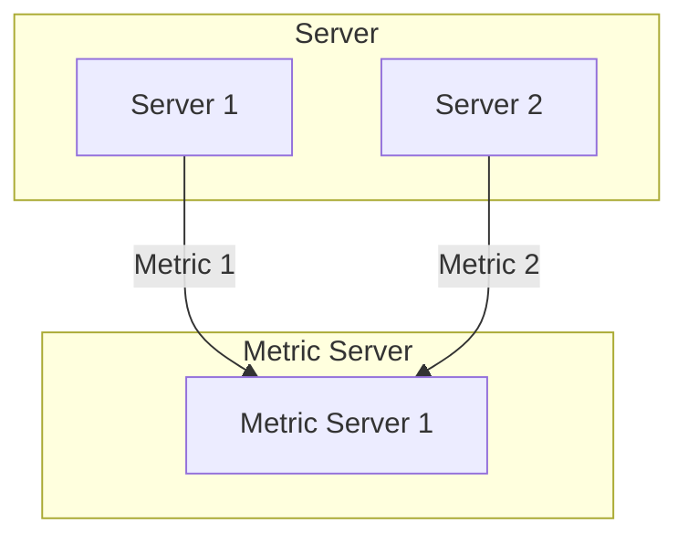
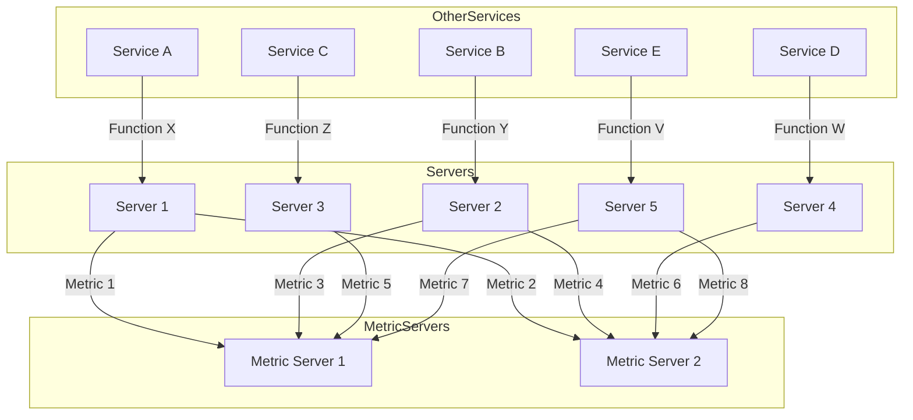
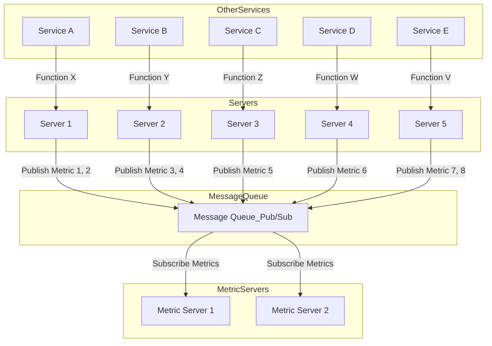
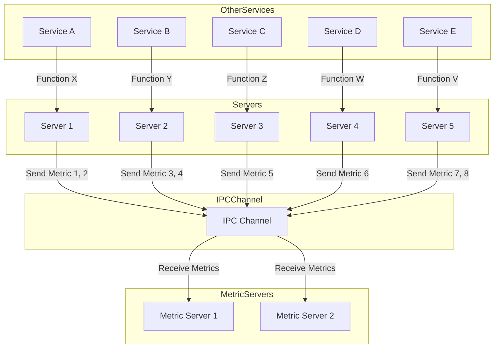

데이터를 이동시키는 작업에 더 적은 노력을 들일수록 핵심 비즈니스에 더욱 집중할 수 있다.
데이터를 어떻게 이동시키느냐의 문제는 데이터 그 자체만큼이나 중요한 것이다.

### 왜 이름이 카프카 일까?

>Confluent 공동 창업자 Jay Kreps는 
>Kafka 라는 소프트웨어가 write 작업에 최적화 되어 있기 때문에 작가 이름을 사용하는 것이 옳다고 판단,
>대학시절 문학 수업때 프란츠 카프카의 작품을 좋아 했기 때문에 사용.

### 메시지?

>한 시스템에서 또 다른 시스템으로 process 되는 게 예상되어지는 information의 한 조각.
>Ex) Data Payload, File, Meta data 등등

> 카프카 입장에서는 키 라는 메타 데이터 값을 갖는 바이트 배열.

### Kafka 는 어떤 문제를 해결하기 위해 Design 되었나
---

#### Point to Point

연결을 추적하기 힘든 구조로 점점 변화해 갑니다.

해결 방법은 ?
가운데에 메시지 큐나 프로세스 간 통신 채널을 만드는 방법이 존재함

Publisher - Subscriber

Sender - Receiver

>IPC Channel 을 쓰지 않고 Message Queue를 사용했을때 얻 을 수 있는 장점?

>그렇다면 Message Queue를 사용해야 하는걸 알았는데
>추가 적으로 Message 처리 해야 하는 상황이 늘어 난다면?
>결국 복잡해지는것 아닌가요?

1. Metric
2. Log
3. Notification
4. Supply Chain
5. Real-TIme Analytics

```mermaid
graph TD
    subgraph Publishers
        FS1[Front Server 1]
        FS2[Front Server 2]
        DBS1[Database Server 1]
        DBS2[Database Server 2]
        CS1[Chat Server]
        BES1[Backend Server]
    end

    subgraph MetricServers
        M1[Metric Server 1]
        M2[Metric Server 2]
    end

    subgraph RealTimeAnalytics
        A1[Real-time Analytics]
    end

    subgraph Notifications
        N1[Notification System]
    end

    subgraph SupplyChain
        SC1[Supply Chain Management]
    end

    subgraph LogProcessing
        L1[Log Processor 1]
        L2[Log Processor 2]
    end

    subgraph MessageQueues
        MQ1[Metrics Queue]
        MQ2[Logs Queue]
        MQ3[Analytics Queue]
        MQ4[Notifications Queue]
        MQ5[Supply Chain Queue]
    end

    %% Connections between all servers and common message queues
    FS1 -- "Publish Metrics" --> MQ1
    FS2 -- "Publish Metrics" --> MQ1
    DBS1 -- "Publish Metrics" --> MQ1
    DBS2 -- "Publish Metrics" --> MQ1
    CS1 -- "Publish Metrics" --> MQ1
    BES1 -- "Publish Metrics" --> MQ1

    FS1 -- "Publish Logs" --> MQ2
    FS2 -- "Publish Logs" --> MQ2
    DBS1 -- "Publish Logs" --> MQ2
    DBS2 -- "Publish Logs" --> MQ2
    CS1 -- "Publish Logs" --> MQ2
    BES1 -- "Publish Logs" --> MQ2

    FS1 -- "Publish Analytics Data" --> MQ3
    FS2 -- "Publish Analytics Data" --> MQ3
    DBS1 -- "Publish Analytics Data" --> MQ3
    DBS2 -- "Publish Analytics Data" --> MQ3
    CS1 -- "Publish Analytics Data" --> MQ3
    BES1 -- "Publish Analytics Data" --> MQ3

    %% Connections between specific servers and related message queues
    FS1 -- "Publish Notifications" --> MQ4
    FS2 -- "Publish Notifications" --> MQ4
    CS1 -- "Publish Notifications" --> MQ4

    DBS1 -- "Publish Supply Chain Data" --> MQ5
    DBS2 -- "Publish Supply Chain Data" --> MQ5
    BES1 -- "Publish Supply Chain Data" --> MQ5

    %% Metric servers subscribing to the Metrics Queue
    MQ1 -- "Subscribe Metrics" --> M1
    MQ1 -- "Subscribe Metrics" --> M2

    %% Log processors subscribing to the Logs Queue
    MQ2 -- "Subscribe Logs" --> L1
    MQ2 -- "Subscribe Logs" --> L2

    %% New use cases subscribing to their respective message queue
    MQ3 -- "Subscribe Analytics Data" --> A1
    MQ4 -- "Subscribe Notifications" --> N1
    MQ5 -- "Subscribe Supply Chain Data" --> SC1

    %% Additional connections from other services to various publishers
    subgraph OtherServices
        OS1[Service A]
        OS2[Service B]
        OS3[Service C]
        OS4[Service D]
        OS5[Service E]
    end

    OS1 -- "Function X" --> FS1
    OS2 -- "Function Y" --> DBS1
    OS3 -- "Function Z" --> CS1
    OS4 -- "Function W" --> BES1
    OS5 -- "Function V" --> FS2

```

결론은 맞습니다.
비즈니스가 확장됨에 따라서 복잡해지는 위와 같은 상황은 많은 문제를 야기할 수 있습니다.

1. 리소스도 버그도 각기 다른 메시지 큐를 각각 어떻게 관리 할 것 인가?
2. 추가로 메시지 사용을 필요로 하는 상황이 생긴다면 어떻게 처리할 것 인가?
3. 수많은 각기 다른 데이터는 어떻게 관리 해야 하는가?

>[!info]
>데이터를 일반화 하여 중앙 집권 화 하여 관리하는 방식을 고려해 볼 수 있습니다. 

### 카프카를 활용할 수 있는 방안 
---

1. 메시지 큐
   
   pub/ sub pattern Message Queue

Topic 별로 consumer 가 topic을 consum 할 수 있음.

대응 되는 AWS Service : [AWS SQS](https://aws.amazon.com/ko/sqs/features/)

2. Event Broker

Event를 push 해줄 수 있음.

대응 되는 AWS Service : [AWS Event Bridge](https://aws.amazon.com/ko/eventbridge/)

3. 실시간 스트리밍 데이터 처리

### 간단하게 보는 Message Queue 구조
---

#### Topic

### 현재 존재하는 Message Queue 들의 차이점
---

>Redis는 pub/sub 기반의 Message Queue로 활용이 가능 할까?

>RebbitMQ 는 영속성이 정말로 보장이 안될까?

> Kafka는 위 경쟁 재품들과 다른 어떤 메리트를 갖고 있는가?

