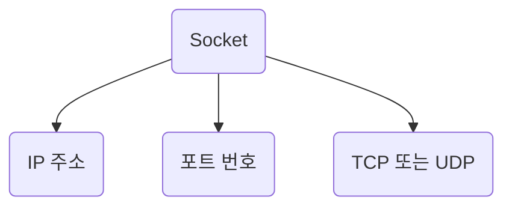
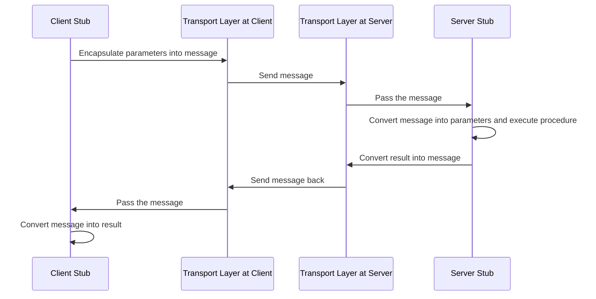

Socket 과 RPC에 대해 살펴보자. 

### Socket 

Socket은 네트워크를 통해 두 프로세스 간의 통신을 가능하게 하는 소프트웨어 구조임. 

주로 원격 정보 교환을 가능하게 하는 함수들의 필요성에 응답하기 위해 사용됨. 

Socket은 IP 주소와 포트 번호를 결합함.

IP 주소는 네트워크 내의 머신을 식별하는 고유한 번호이며, 포트 번호는 네트워크 내의 프로세스를 식별하는 고유한 논리적 식별자임. 

Socket 프로그래밍에서는 일반적으로 두 가지 주요 통신 모드를 사용함

### UDP & TCP

`UDP (User Datagram Protocol) `

UDP는 소위 "비연결형" 프로토콜임.

이 말은, 데이터를 보내기 전에 데이터 수신자와의 통신 경로를 설정하지 않는다는 것.

그저 데이터를 보내고, 네트워크가 그것을 전달하길 바람.

이러한 특성 때문에 UDP는 전송 속도가 빠르며, 리소스를 덜 사용함.

하지만, 모든 데이터 패킷이 목적지에 도착하거나, 도착 순서대로 도착한다는 보장이 없음.

이러한 UDP의 특성 때문에, 실시간 스트리밍 애플리케이션(예: Zoom, Discord, Skype)이나 온라인 게임에서 UDP를 사용하는 것을 선호함.

이러한 애플리케이션에서는 일부 데이터 패킷의 손실이나 순서 변경이 발생해도, 전체 사용자 경험에 미치는 영향이 미미하기 때문.

예를 들어, `Zoom 회의에서 일부 비디오 프레임이 손실되어도, 전체 회의 경험에는 크게 영향을 미치지 않는다`.
    
`TCP (Transmission Control Protocol)`

TCP는 "연결형" 프로토콜임. 

이 말은, 데이터를 보내기 전에 데이터 수신자와 통신 경로를 먼저 설정해야 한다는 것. 

이렇게 하면, 모든 데이터 패킷이 순서대로 도착하고, 누락된 패킷은 재전송됨.

이로 인해 TCP는 데이터의 무결성과 신뢰성이 매우 중요한 상황에서 선호되는 프로토콜임.

하지만, 이러한 기능들은 더 많은 리소스를 사용하고, 데이터 전송 속도가 느려질 수 있음.

이러한 TCP의 특성 때문에, 데이터의 무결성이 중요한 애플리케이션에서 TCP를 사용하는 것을 선호함.

예를 들어, FTP(File Transfer Protocol) 같은 경우에는, 파일의 모든 부분이 정확하게 전송되어야 하므로, TCP를 사용함. 

이 경우, 데이터 패킷이 손실되면, 해당 패킷은 다시 전송되어, 파일의 완전한 복사본이 수신자에게 전달됨.

## RPC 

`원격 프로시저 호출(RPC)`은 한 컴퓨터가 네트워크에 있는 다른 컴퓨터의 매개변수를 사용하여 특정 프로시저를 실행할 수 있도록 하는 프로세스 간의 통신 프로토콜임. 

RPC는 분산 시스템에서 주로 사용되며, 이를 사용하면 개발자는 복잡한 네트워크 통신 세부 사항을 크게 고려하지 않고도 프로세스 간 통신을 수행할 수 있음.

RPC의 기본적인 흐름은 다음과 같느

1. 클라이언트는 클라이언트 스텁 프로시저를 통해 원격 프로시저를 호출. 
   이 스텁은 파라미터를 메시지로 캡슐화하고 이를 전송 계층으로 전송.
2. 서버의 전송 계층은 메시지를 받아 서버 스텁으로 전달.
3. 서버 스텁은 메시지를 파라미터로 변환하고 해당 원격 프로시저를 실행.
4. 실행 결과는 다시 메시지로 변환되어 클라이언트로 전송.
5. 클라이언트 스텁은 받은 메시지를 결과로 변환.

이러한 RPC의 작동 방식은 높은 수준의 추상화를 제공하여 개발자가 네트워크 통신의 복잡성을 크게 고려하지 않고도 프로세스 간 통신을 수행할 수 있게 해줌.

## 차이점 

Socket과 RPC는 모두 정보 흐름의 채널을 생성하는 동일한 목표를 공유함. 

이는 두 개의 다른 엔드포인트 프로세스가 로컬 또는 원격에서 서로 메시지를 통해 통신할 수 있게 힘. 

하지만 이 두 기술 사이에는 몇 가지 핵심적인 차이점이 존재함.

## 차이점 표

| |Socket|RPC|
|---|---|---|
|정의|통신을 유지하기 위한 소프트웨어 구조|통신의 프로토콜|
|구성|독립적인 구조로 연결을 생성하는 데 사용 가능|Socket을 사용하여 연결을 제공|
|설정|프로그래머가 모든 Socket의 구성을 설정해야 함|구성 설정이 필요 없음|
|레이어|복잡한 코드의 하위 레이어이지만, 유연성과 효율성이 높음|코드는 단순하지만 효율성이 떨어짐|
|대역폭|송신에 대해 네트워크 대역폭이 적게 사용됨|더 많은 대역폭을 사용함|
|의존성|자체 함수에 의존함|Socket 함수에 의존하며, 추가 기능을 가짐|
|연결 모드|Socket 프로그래밍은 UDP와 TCP의 두 가지 연결 모드만 허용함|RPC는 다양한 프로토콜에서 구현 가능|
|난이도|네트워크 통신의 자연적인 제약으로 인해 어렵고 시간이 소요됨|비교적 덜 어렵고 시간이 덜 소요됨|

`정의`
`소켓`은 통신을 유지하기 위한 기본 소프트웨어 구조. 
이는 네트워크 상에서 두 대의 컴퓨터가 데이터를 교환할 수 있도록 하는 엔드포인트를 제공.
`RPC`는 통신의 프로토콜로서, 한 시스템의 프로세스가 다른 시스템의 프로세스에 특정 작업을 요청하는 방식을 정의. 
`RPC`는 소켓 위에서 동작하며, 원격 시스템에 대한 프로시저를 로컬 프로시저처럼 호출하는 것을 가능하게 합니다

`구성`
`소켓`은 독립적인 구조로, 이를 통해 두 대의 컴퓨터 사이에 직접적인 연결을 설정할 수 있음. 
`RPC`는 소켓을 사용하여 클라이언트와 서버 사이의 연결을 제공하는 고수준의 프로토콜임.

`설정`
`소켓`을 사용하면 프로그래머가 모든 소켓의 구성을 직접 설정해야 함.
`RPC`는 개발자에게 복잡한 네트워크 통신 세부사항을 숨겨주는 더 높은 수준의 추상화를 제공.

`레이어`
`소켓`은 하위 레이어의 복잡한 코드를 사용하지만, 이로 인해 높은 유연성과 효율성을 제공. 
`RPC`는 더 높은 레이어에서 작동하며, 코드는 더 단순하지만 효율성은 상대적으로 떨어집니다.

`대역폭`
`소켓`은 데이터 전송에 더 적은 네트워크 대역폭을 사용하며, 이는 전송 속도와 효율성에 이점을 제공.
`RPC`는 더 많은 대역폭을 사용하며, 이는 복잡한 연산을 수행하는 데 필요한 추가 정보를 전송하는 데 사용.

`의존성`
`소켓` 프로그래밍은 소켓의 자체 함수에 의존하며, 이는 개발자에게 높은 수준의 제어력을 제공. 
`RPC`는 소켓 함수에 의존하되, 추가적인 기능들을 통해 더 복잡한 상호작용을 지원.

`연결모드`
`소켓`은 UDP(User Datagram Protocol)와 TCP(Transmission Control Protocol)의 두 가지 연결 모드만 제공함
`RPC`는 프로토콜 간에 호환성이 있는 구조로 설계되어 다양한 프로토콜에서 구현될 수 있음. 
예를 들어, gRPC는 Google에서 개발된 RPC 프레임워크로, HTTP/2 프로토콜을 기반으로 구현됨.

`난이도`
`소켓`은 프로그래머가 모든 소켓의 구성을 설정해야 하며, 연결 설정 및 해제, 데이터 패킷의 분할 및 조립, 오류 처리 등을 직접 처리해야 함.
`RPC`는 비교적 `소켓`에 비해 난이도가 적고 시간이 덜 소요될 수 있음.
`RPC`는 소켓 함수에 의존하며, 추가 기능을 가지고 있어 네트워크 통신을 추상화하여 사용자가 직접 세부 사항을 다루지 않아도 됨.
또한 다양한 프로토콜에서 구현할 수 있어 사용자는 특정 프로토콜에 대한 이해 없이도`RPC`를 활용할 수 있음.
따라서 네트워크 통신에 대한 이해도와 구현 시간이 적어질 수 있음.

### 참조

[Socket vs. RPC | Baeldung on Computer Science](https://www.baeldung.com/cs/socket-vs-rpc)
