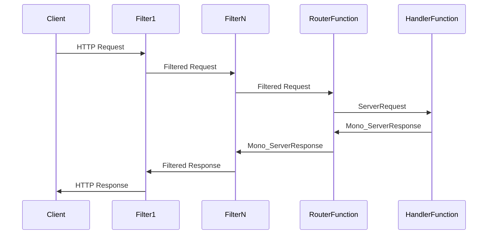

functional web framework는 함수를 사용하여 요청을 라우팅하고 처리하는 새로운 프로그래밍 모델을 도입.

어노테이션 매핑을 사용하는 어노테이션 기반 모델과 달리 여기서는 `HandlerFunction`과`RouterFunction`을 사용함.

`functional endpoint`접근 방식은 동일한 리액티브 스택에 구축됨.

### Dependency

사용하려면 당연히 webflux 가 필요함.

Maven
```xml
<dependency>
    <groupId>org.springframework.boot</groupId>
    <artifactId>spring-boot-starter-webflux</artifactId>
</dependency>
```

Gradle
```groovy
dependencies {
    implementation 'org.springframework.boot:spring-boot-starter-webflux'
}
```


### HandlerFunction and RouterFunctions

annotations 을 활용해서 매핑하는것과 달리 HandlerFunction and RouterFunctions을 활용할 수 있음.

일반적으로 완전한 라우터 함수를 작성하는 대신 도우미 함수 RouterFunctions.route()를 임포트하여 경로를 생성할 수 있음.

이 함수를 사용하면 RequestPredicate를 적용하여 요청을 라우팅할 수 있음니다.  \
predicate가 일치하면 두 번째 인수인 핸들러 함수가 반환됨. \
즉 RouterFunction은 요청이 특정 경로와 일치할 때 실행할 경로, 관련 HTTP 메서드, 핸들러 함수를 정의하는 역할을 담당함,

```java
@FunctionalInterface
public interface RouterFunction<T extends ServerResponse> {
    Mono<HandlerFunction<T>> route(ServerRequest request);
    // ...
}
```


RouterFunctions는 @RequestMapping 어노테이션을 대체하는 역할을 함. \
이를 사용하여 요청을 HandlerFunction로 라우팅할 수 있음.

들러 함수: 핸들러 함수는 들어오는 HTTP 요청을 처리하고 적절한 응답을 생성하는 함수형 인터페이스입니다. 이 함수는 서버 요청 객체를 입력으로 받고 출력으로 모노<서버 응답>을 반환합니다.  \ 
핸들러 함수에는 데이터 검색, 처리, 응답 반환 등 요청을 처리하기 위한 실제 로직이 포함되어 있습니다.

```java
@FunctionalInterface
public interface HandlerFunction<T extends ServerResponse> {
    Mono<T> handle(ServerRequest request);
}
```


### Functional EndPoint

`functional endpoint` 는 함수형 프로그래밍 스타일을 사용하여 HTTP request-response interactions을 정의하고 처리하는 접근 방식임.  \
`A functional endpoint`는 라우터 및 핸들러 함수를 사용하여 구축되며, 라우터 및 해당 요청 핸들러를 보다 명시적이고 유연하게 정의할 수 있는 방법을 제공함.\

함수형 프로그래밍 스타일을 사용하며 라우터 및 핸들러 함수를 기반으로 함  \
메서드 체인 및 람다 표현식을 사용하여 라우터와 해당 핸들러를 정의할 수 있음.

```java
// Handler
public Mono<ServerResponse> helloWorld(ServerRequest request) {
    return ServerResponse.ok().contentType(MediaType.TEXT_PLAIN).body(BodyInserters.fromValue("Hello, World!"));
}

// Router
@Bean
public RouterFunction<ServerResponse> route() {
    return RouterFunctions.route(RequestPredicates.GET("/hello"), this::helloWorld);
}
```

### Flow

하위 filter 1 ~ filterN 구간은 filter chain 구간임.



### Annotation-based controllers

Annotation-based controller는 일반적으로 spring boot에서 Rest-API를 만들때 사용하는 방식과 같이  클래스 및 메서드에 주석을 달아 요청 매핑 및 핸들러를 정의하는 명령형 프로그래밍 스타일을 사용함.

```java
@RestController
public class HelloWorldController {

    @GetMapping("/hello")
    public Mono<String> helloWorld() {
        return Mono.just("Hello, World!");
    }
}

```

### 장단점

`Functional EndPoint`

장점 \
유연성 향상, 명시성 향상, 모듈화 및 유지보수 용이성 향상.

단점 \
러닝커브가 좀 있는편, 일부 Spring 기능과의 통합이 덜이루어져 있음.

`Annotation Controller`

장점 \
Spring MVC에 익숙한 기존 개발자들이 이해가 용이함. \
Spring 기능과의 통합이 지금까지 잘 이루어져 있고 안전하게 활용되고 있기 때문에 현시스템내에서는 기능적 통합 측면에서는 더나음.

단점 \
유연성이 떨어지고 미리 정의된 주석 및 규칙에 의존하게됨.


### 참조
[Introduction to the Functional Web Framework in Spring 5 | Baeldung](https://www.baeldung.com/spring-5-functional-web) \
[spring mvc - What is the difference between Router and Annotated Controllers? - Stack Overflow](https://stackoverflow.com/questions/51786154/what-is-the-difference-between-router-and-annotated-controllers) \
