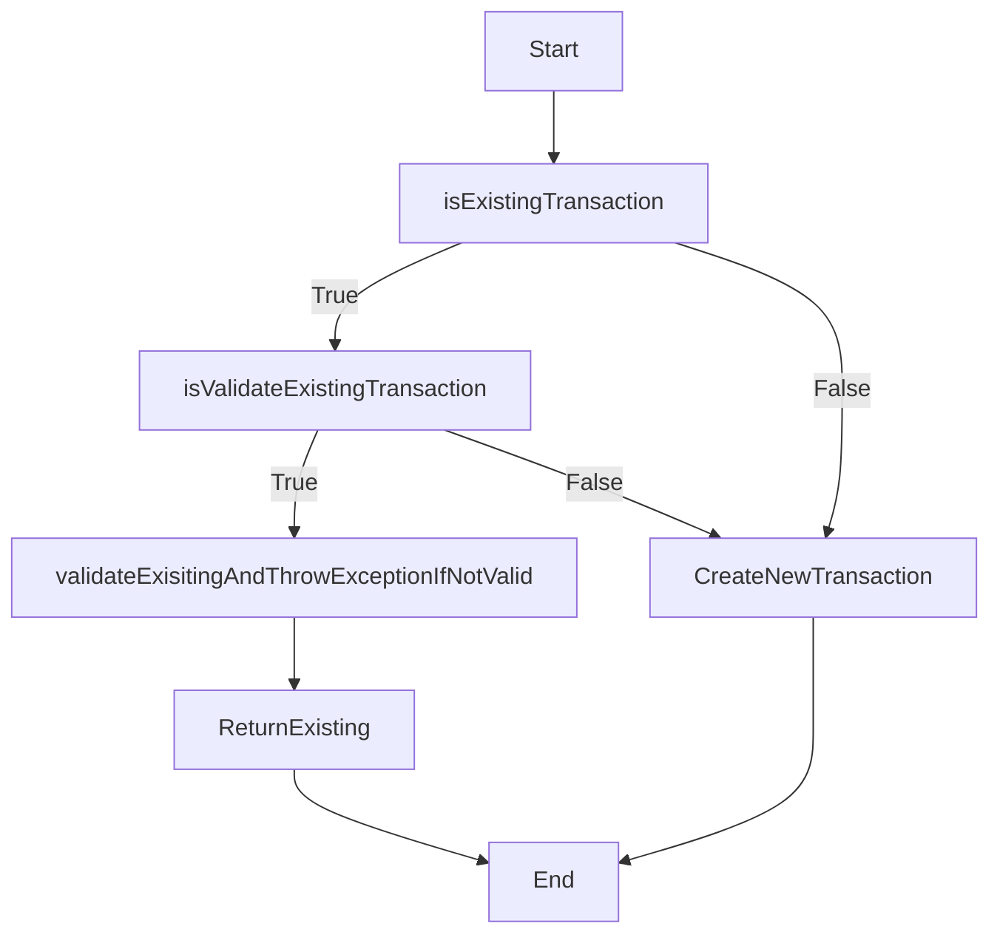
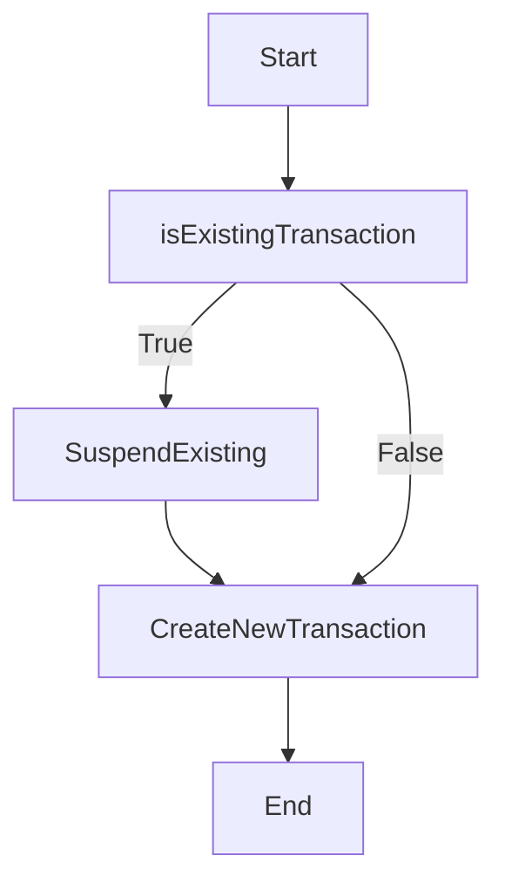
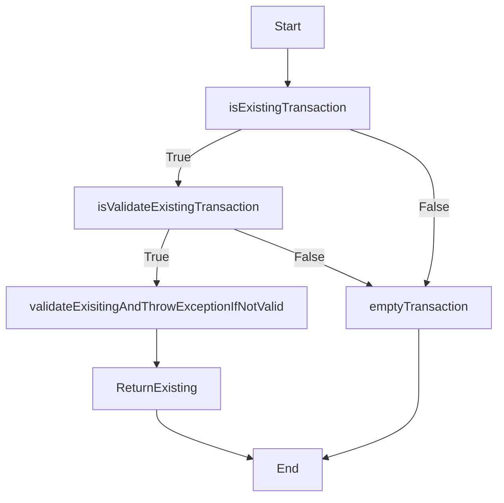

***
트랜잭션 어노테이션의 propagation attribute을 사용하여 트랜잭션 전파 유형을 지정할 수도 있음.

propagation type은 여러 트랜잭션이 관련된 경우 트랜잭션이 전파되는 방식을 결정.

트랜잭션 전파에는 여러 가지 유형이 존재함.

## Propagation.REQUIRED

기본 전파 유형.
트랜잭션이 이미 있는 경우 현재 메서드가 해당 트랜잭션에 참여.
트랜잭션이 존재하지 않으면 메서드에 대한 새 트랜잭션이 생성.

```java
@Transactional(propagation = Propagation.REQUIRED) public void requiredExample(String user) { // ... }
```

REQUIRED는 Default 이므로 생략이 가능.

```java
@Transactional(propagation ) 
public void requiredExample(String user) { // ... }
```


### Flow




## Propagation.REQUIRES_NEW

이 전파 유형은 항상 새 트랜잭션을 만듬
트랜잭션이 이미 존재하는 경우 새 트랜잭션이 완료될 때까지 일시 중단.

```java
@Transactional(propagation = Propagation.REQUIRES_NEW) public void requiresNewExample(String user) { // ... }
```

### Flow




## Propagation.SUPPORTS

이 전파 유형은 트랜잭션이 이미 존재하는 경우 트랜잭션을 지원.
트랜잭션이 존재하면 해당 트랜잭션 내에서 현재 메서드가 실행. 
트랜잭션이 존재하지 않으면 트랜잭션 없이 메서드가 실행.

```java
@Transactional(propagation = Propagation.SUPPORTS) public void supportsExample(String user) { // ... }
```

### Flow




### Propagation.NOT_SUPPORTED

이 전파 유형은 트랜잭션을 지원하지 않음.
트랜잭션이 존재하면 현재 메서드가 실행되는 동안 트랜잭션이 일시 중단됨.

```java
@Transactional(propagation = Propagation.NOT_SUPPORTED) public void notSupportedExample(String user) { // ... }
```


### 참조
https://www.baeldung.com/spring-transactional-propagation-isolation
https://stackoverflow.com/questions/8490852/spring-transactional-isolation-propagation
https://dzone.com/articles/spring-transaction-propagation
