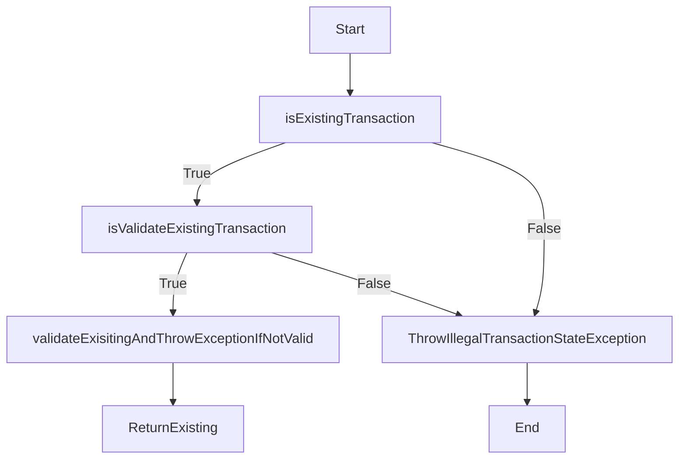
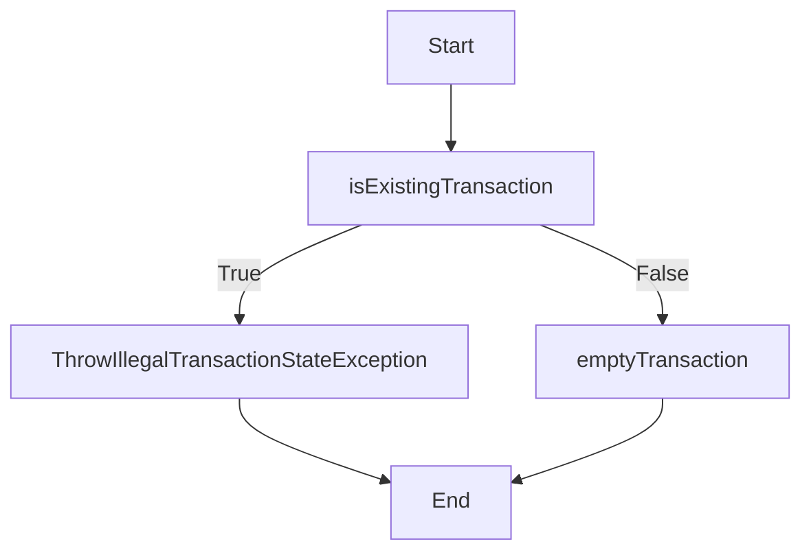
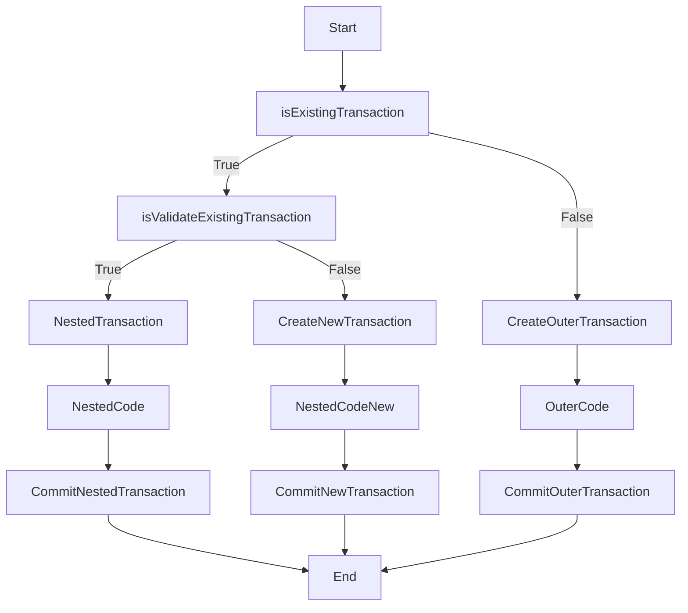

## Propagation.MANDATORY

이 전파 유형은 트랜잭션이 이미 존재해야 함.\
트랜잭션이 존재하지 않으면 예외가 발생함.

```java
@Transactional(propagation = Propagation.MANDATORY) public void mandatoryExample(String user) { // ... }
```

### Flow




## Propagation.NEVER

이 전파 유형은 현재 메서드가 실행될 때 트랜잭션이 존재하지 않는지 확인함.\
트랜잭션이 존재하면 예외가 발생함.

```java
@Transactional(propagation = Propagation.NEVER) public void neverExample(String user) { // ... }
```


### Flow




## Propagation.NESTED

이 전파 유형은 중첩된 트랜잭션을 생성함.\
트랜잭션이 이미 존재하는 경우 새 트랜잭션이 생성되어 기존 트랜잭션 내에 중첩됨.\
트랜잭션이 존재하지 않으면 새 트랜잭션이 생성됨.

```java
@Transactional(propagation = Propagation.NESTED) public void nestedExample(String user) { // ... }
```


### Flow

