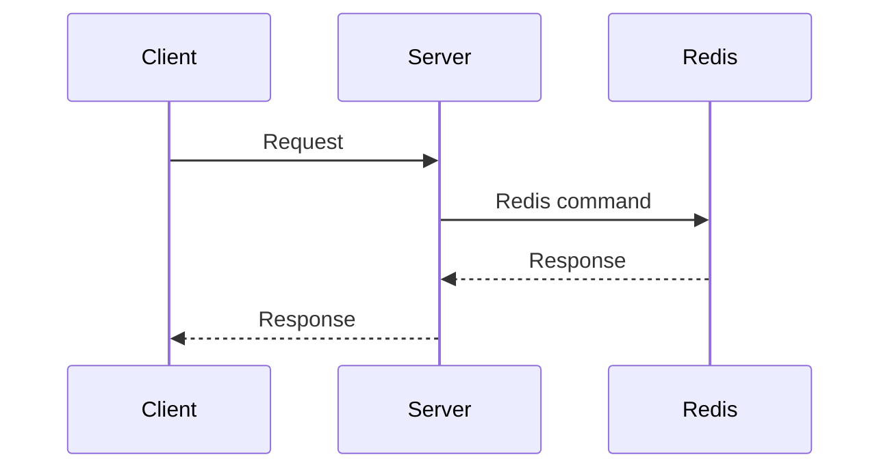
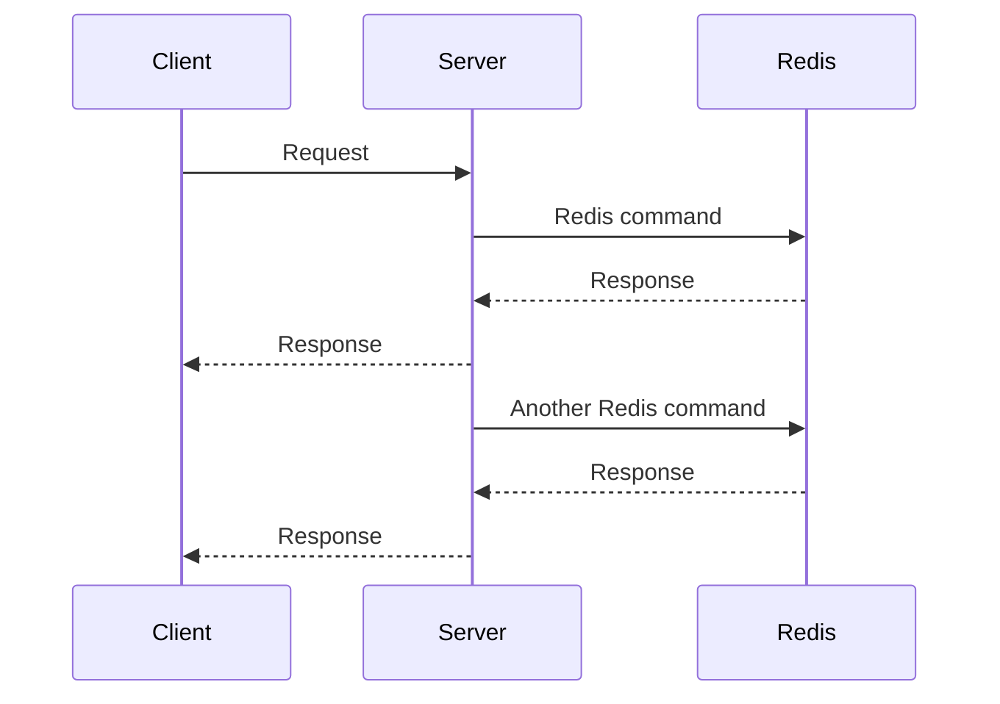

### Redis Client & Server

**Client**

`Redis client`는 일반적으로 `Redis 서버`에 연결하고 요청을 보내는 라이브러리 또는 어플리케이션을 의미.

여기서 `client`는 `client-server model` 에서 client를 의미.

사용자의 요청을 처리하고 이를 서버로 전달하는 역할을 함.

Spring Boot 애플리케이션에서는 보통 외부에서 실행중인 Redis 서버에 연결하여 데이터를 저장하거나 검색하는 데 사용됨.

>**이때, Spring Boot 애플리케이션은 Redis 클라이언트 역할을 함.**

**Server**

`Redis server`는 `실제 Redis 데이터베이스 인스턴스`를 의미.

### Lettuce

>Redis 내에서 Lettuce는 비동기, 동기, 그리고 반응형 프로그래밍 모델을 지원하는 Redis 클라이언트로,
>`내부적으로 Netty를 사용하여 비동기 I/O 처리`를 함.


### io.lettuce:lettuce-core

**package**

```plaintext
+--- org.springframework.boot:spring-boot-starter-data-redis-reactive -> 3.0.4  
		 //...
|         \--- io.lettuce:lettuce-core:6.2.3.RELEASE  
|              +--- io.netty:netty-common:4.1.89.Final  
|              +--- io.netty:netty-handler:4.1.89.Final  
|              |    +--- io.netty:netty-common:4.1.89.Final  
|              |    +--- io.netty:netty-resolver:4.1.89.Final  
|              |    |    \--- io.netty:netty-common:4.1.89.Final  
|              |    +--- io.netty:netty-buffer:4.1.89.Final  
|              |    |    \--- io.netty:netty-common:4.1.89.Final  
|              |    +--- io.netty:netty-transport:4.1.89.Final  
|              |    |    +--- io.netty:netty-common:4.1.89.Final  
|              |    |    +--- io.netty:netty-buffer:4.1.89.Final (*)  
|              |    |    \--- io.netty:netty-resolver:4.1.89.Final (*)  
|              |    +--- io.netty:netty-transport-native-unix-common:4.1.89.Final  
|              |    |    +--- io.netty:netty-common:4.1.89.Final  
|              |    |    +--- io.netty:netty-buffer:4.1.89.Final (*)  
|              |    |    \--- io.netty:netty-transport:4.1.89.Final (*)  
|              |    \--- io.netty:netty-codec:4.1.89.Final  
|              |         +--- io.netty:netty-common:4.1.89.Final  
|              |         +--- io.netty:netty-buffer:4.1.89.Final (*)  
|              |         \--- io.netty:netty-transport:4.1.89.Final (*)  
|              +--- io.netty:netty-transport:4.1.89.Final (*)  
|              \--- io.projectreactor:reactor-core:3.4.27 -> 3.5.3  
|                   \--- org.reactivestreams:reactive-streams:1.0.4
```

`spring-boot-starter-data-redis-reactive` 는 spring data redis와 lettuce를 참조하고 있는데 gradle dependency tree 에서도 볼 수 있듯 `lettuce`는 `netty`와 `project reactor`, `reactive streams`를 참조해서 갖고있다.

그말은 즉.

1. 비동기, 동기, 그리고 리액티브 API를 제공. 
   이 API를 통해 Redis와 상호 작용할 수 있음.
  
2. Master/Slave, Sentinel, 그리고 Cluster 모드를 지원.
   이를 통해 다양한 Redis 배포 전략을 지원.

3. Netty를 기반으로 비동기 I/O 처리를 수행.

4. ReactiveStream 을 활용한 Flux와 Mono와 같은 반응형 타입 및 back-pressure등의 기능도 활용 가능.


### 비동기 Reactive Redis vs 동기 Redis

비동기 Reactive Redis와 일반적인 동기 방식의 Redis를 비교할 때, 두 가지의 차이점이 크게 드러난다. 

### 동기 Redis




이 경우에서는, 모든 요청이 순차적으로 이루어짐. 

클라이언트는 서버에 요청을 보내고, 서버는 Redis에 명령을 보냄.

Redis는 그에 대한 응답을 서버에 보내고, 서버는 그에 대한 응답을 클라이언트에 보냄.

이 모든 작업이 순차적으로 이루어지므로, 각 단계가 완료되기를 기다리는 동안 다른 작업을 수행할 수 없음.

### 비동기 Reactive Redis



이 경우에서는, 비동기 방식으로 처리되므로, 한 번에 여러 요청을 처리할 수 있음.

서버는 Redis에 명령을 보내고, 응답을 기다리는 동안에 다른 작업을 계속 수행할 수 있음.

이는 시스템의 확장성을 크게 향상시키며, 높은 트래픽의 환경에서 매우 유용.

> WebFlux 를 사용하지 않고도 설정하면 비동기 Lettuce를 활용한 비동기 Redis를 사용할 수야 있지만.
> WebFlux와 연동해서 Spring Data Reactive Redis 를 같이 사용하는게 편하게 구축 가능함.