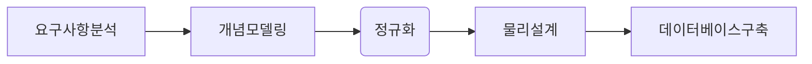

**WBS(Work Breakdown Structure)**

WBS를 통해 어떤 일을 언제 하고 결과는 어 떤 것이 나오는 지를 알 수 있다.

#### 요구사항 분석 단계

- 데이터베이스에서 관리해야 하는 데이터를 도출하고 분석하는 단계
- 요구 사항은 업무를 수행하는데 필요한 데이터에 대한 요구/데이터 구조에 대한 요구/성능에 대한 요구 일수도 있다.
- 요구 사항은 사용자의 의견을 최우선으로 따르며 현업과 인터뷰를 통해 도출.

#### 개념 모델링

- 개념 모델은 요구 사항을 분석하고 나서 도출되는 데이터 측면의 결과물이다.
- 개념 모델은 요구 사항을 개념적으로 반영한 모델.
- 개념 모델링 단계에서는 핵심 데이터를 대상으로 모델링을 수행해야 하며 통합된 모델이 도출돼야 한다.

#### 논리모델링(정규화)

- 정규화는 데이터의 분해를, 일반화는 데이터의 통합을 의미.
- 논리 모델링 단계는 핵심 데이터를 포함한 모든 데이터를 대상으로 모델링을 수행하는 단계.
- 정규화는 함수 종속(Functional Dependency)에 의해 데이터를 분해하는 것, 이 단계에서는 더 분해할 수 없는 엔터티의 모습이 나타나게 됨.
- 개념 모델에서 도출된 엔터티는 실상 엔터티보다 더 큰 개념일 수도 있고 그대로 엔터티가 될 수도 있다.
- 정규화를 거쳐 분해된 엔터티는 엔터티 그 자체이다.
- 이 엔터티가 물리 설계 단계에서 목적에 의해 하나의 테이블로 합쳐지거나 두 개 이상의 테이블로 분리 될 수 있음.
- 엔터티는 식별자와 식별자가 아닌 속성 사이의 의존성에 의해서 분해 됨.
- 데이터가 통합된 모습에서 함수 종속에 의해 속성이 분해될 뿐이다.
- 이렇게 더 분해되지 않도록 최대한 분해된 모델을 정규형이라고 하고 정규화된 모델을 논리 모델(Logical Model) 이라고 함.
- 엔터티를 정규화하면 데이터 무결성은 높아짐.

#### 물리 설계

- 논리 모델을 물리 모델로 매핑하고 목적에 따라 테이블을 분해하거나 합치는 작업을 함.
- 이 단계에서 가능한 성능을 최적화해야 함.
- 성능을 위해서 중요한 작업이 비 정규화 임.
- 정규화는 반드시 거쳐야 하는 필수 과정이고 정규화가 완전히 끝나야 비정규형을 고려할 수 있음.
- 인덱스 설계가 포함됨.
- 인덱스 설계는 대단히 중요한데 물리 설계 단계에서 완전하게 이루어지지 않고 파티셔닝 전략을 세우고 많은 테스트를 거쳐야 하며  
  클러스터링이나 IOT등의 테이블 타입도 시중하게 고려해야 한다.

#### 데이터베이스 구축

- 물리 설계에서 도출된 여러 객체를 생성하는 단계
- 물리 설계에서 스크립트가 나오므르 이 단계에서는 모델러 보다는 보통 DBA가 수행하게 된다.
- 데이터베이스가 구축되고 나서는 데이터가 적재되고 운영된다
- 운영하면서 문제점이 발생하면 방안을 찾아 대처해야 하며 요구 사항이 추가되거나 변경되면서 모델 변경 관리를 하게 된다.