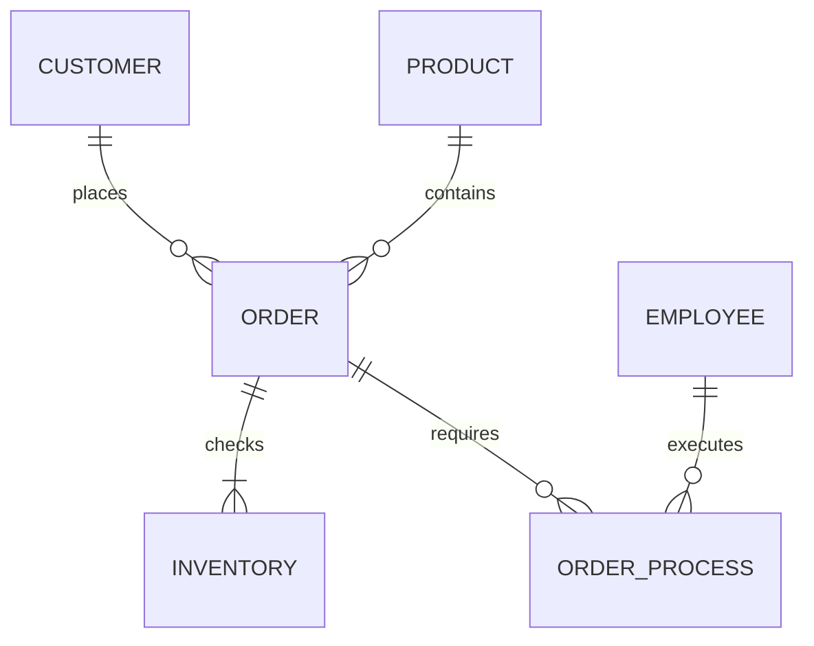

>관계형 데이터베이스에서 관리되고 운영되는 데이터 모델이 관계형 모델(Relational Model)이며 관계형 모델은 주로 ERD로 표현한다.


###  ERD 작성시 엔티티 배치
---

엔터티를 배치할 때는 `상위(부모) `엔터티가 `하위(자식)` 엔터티의 `위쪽`에 있는 것이 좋다.

상위(부모) 엔터티와 하위(자식) 엔터티를 `좌우`로 위치시키는 것도 좋다, `상위는 왼쪽`에 `하위는 오른쪽`에 위치시키면 된다.

서브타입의 개수가 많아 상하로 배치하기 어렵다면 슈퍼타입 오른쪽에 서브타입을 위치시킨다.

### 앤티티 종류 간략 설명 및 엔티티 종류별 배치 요령
---

1. **실체 엔티티 (Entity Entities)** 
   이들은 일반적으로 모델의 상단에 위치하는게 좋으며, 조직의 주요 존재물을 나타냄. 

```plaintext
'사원', '제품', '고객' 등은 실체 엔티티의 예.
```

2. **행위 엔티티 (Action Entities)** 
   행위 엔티티는 일반적으로 실체 엔티티의 하위에 위치하며, 특정 동작이나 이벤트를 나타냄.

```plaintext
'주문', '결제' 등은 행위 엔티티의 예
```
  
3. **가공 엔티티 (Processed Entities)** 
   이들 엔티티는 데이터를 집계, 요약 또는 변환하는 데 사용되며, 별도로 위치시키거나 관련된 행위 엔티티 주변에 위치시킬 수 있음.

```plaintext
'재고 확인', '주문 처리' 등은 가공 엔티티의 예
```

  
4. **교차 엔티티 (Associative Entities)** : 이들 엔티티는 일반적으로 두 개 이상의 실체 엔티티 사이의 관계를 나타내며, 관련 엔티티 사이에 위치하는 것이 가장 좋습니다. 예를 들어, '고객'과 '주문' 사이의 '주문 내역'은 교차 엔티티의 예입니다.

```plaintext
'고객'과 '제품' 사이의 '주문' 등은 교차 엔티티의 예
```

**종합 예시**




엔터티에서 `중요한` 속성이나 `자주 사용`되는 속성은 엔터티 `상단`에 위치하는 것이 좋다.

`일관된 속성 순서를 적용`하는 것이 좋으며, 엔터티마다 속성순서를 정하는 원칙이 `달라지지 않는 것`이 바람직 하다.

`주 식별자`는 엔터티의 `최상단`에 위치해야 한다.