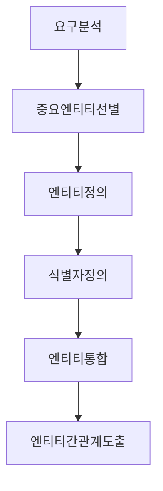

주제 영역 모델(Subject Area Model), 비즈니스 모델(Business Model) 이라고 불리기도 함.

개념 모델의 주요 Flow를 살펴 보자.

### 목적
---

>  중요한 데이터를 가장 간단하게 표현하기. \
>  표현 -> ERD or UML or 문서. \
>  개념 모델링 범위 --> 주제 영역의 핵심적인 Entity 와 Entity 사이 관계 도출.

### 개념 모델의 주요 단계
---

### 요구 분석
---

**데이터 관점의 요구사항 분석**

어떤 업무를 하려면 어떤 데이터가 사용되어야 하는지?

요구사항분석은 논리/물리 모델링중에도 반영된다

현업 IT 담당자와의 상세 인터뷰 를 통해 현행 데이터의 문제점과 개선 해야 할 점을 요구하고, 향후 추가되거나 보완 해야 하는 업무에 대해서도 데이터 관점에서 요구.

### 중요 엔티티 선발
---

>핵심 적인 엔티티 선별

`너무 많은 엔티티`를 대상으로 개념 모델링을 수행하지 말 것 `복잡성`에 빠져 `개념을 파악하기 어렵게` 됨

`복잡하게 접근`하지 말 것, 데이터의 `기초 구조`를 구축하는데 실패할 수도 있음

11회차 모델링 방법론에서 선별 방법 상세 기술.

### 엔티티 정의
---

>핵심 엔티티 선별후 해당 엔티티 분석하면서 정의를 명확하게 하는 작업. \
>그 엔티티가 어떤 데이터로 구성되었고 그 데이터를 묘사하는 요소들이 무엇인지 그 요소 중 결정자 역할을 하는 것이 무슨 속성인지 등을 선언.
>
>데이터의 성격 과 정체성에 맞도록 데이터를 규명해야 한다는 것

### 식별자 정의
---
>엔티티에서 결정자 역할을 하는 속성이 식별자 이므로 엔티티 정의에 대한 확신이 있다면 식별자 정의에 있어도 확신이 생김. \
>의욕이 앞서 많은 속성을 도출할 경우 가독성이 떨어지고 개념적으로 이해하는데 방해가 됨. \
>식별자와 소수의 속성만 도출해야 함.

### 엔티티 통합
---
>유사한 성격의 데이터를 일반화 시키는것.(5회차 에서 상세 기술)

주제 영역 별로 개념 모델을 도출하면 엔티티는 통합된 모습이어야 함.

주제 영역을 잘못 도출하거나, 엔티티를 잘못 할당하면 유사한 데이터가 2~3군데 주제 영역에 존재할 수 있음.

### 엔티티 간 관계 도출
---
>핵심 엔티티간의 관계는 논리 모델이나 물리 모델에서도 `불변` 이어야 하므로 개념 모델링 단계에서 명확하게 규명 해야함

데이터 발생 순서, 업무 프로세스, 주 식별자가 같다는 이유로 실제 존재하지 않는 관계를 표현하면 안됨.

관계는 참조 무결성(Referential Integrity) 제약과 연관 되므로 데이터 무결성 차원에서 대단히 중요한 요소.

현실적으로 FK 제약을 생성할 수 없는 떄가 존재하기에 바람직하진 않으나 FK 제약 없이 운영 하기도 함.

