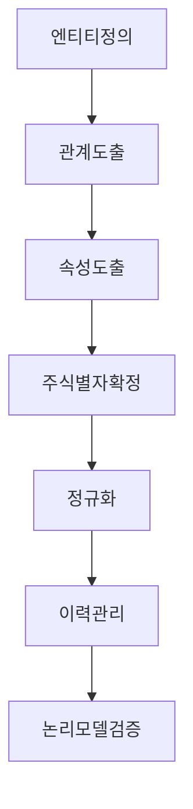

논리 모델의 주요 Flow를 살펴 보자.

### 목적
---

>개념 모델을 상세화 하는 작업을 진행. \
>도출된 핵심 엔터티에 대해 이미 도출된 중요 속성 이외 전체 속성을 도출해야 함. \
>개념 모델링 단계에서 도출되지 않은 대부분의 엔티티가 도출되어야 함. \
>관계를 포함한 모든 데이터 요소가 도출되어야 하므로 전체 데이터 모델링 과정에 가장 오랜 시간이 걸림.

논리 모델은 모든 요건이 반영된 모델, 즉 더는 삭제할 엔티티나 속성이 없는 모델임. 

논리 모델이 완료되면 사실상 모델 구조적으로는 거의 모든 결정이 이루어지며 사실상 데이터 모델링은 완료됨.

만약 물리 모델에서 구조적으로 큰 변화가 발생하면 논리 모델링이 잘못 수행되었다고 볼 수 있다.

### 리모델링
---

모델링이 어려운 이유 중 하나는 이론과 실무가 조금 다를 때가 존재함.

대부분 책이나 문서에서 다루는 모델링은 신규로 구축하기 위해서 수행하는 모델링임.

대부분 기존 시스템이 존재하며 기존 데이터를 마이그레이션 해가며 계속 사용해 나가야 하기 때문에 리 모델링 방법이 사용됨.

하향식이 아니라 상향식 방법론으로 수행됨.

### 논리 모델의 주요 단계
---

### 엔티티의 정의
---

> 논리 모델링 단계에서는 구축된 핵심 엔티티를 중심으로 전체 인티티를 상세화해야함. \
> 상세화 과정에서 실체, 행위, 목적, 기준 엔티티가 모두 도출되며 누락되면 안됨. \
> 자세한건 7회차에서 나옴.

포인트는 데이터의 성격 즉 해당 데이터의 `정체성`에 맞도록 엔티티가 도출되어야 하며 `유사한 데이터`가 `여러 엔티티`에 존재하거나 `하나의 엔티티`에 여러가지 `데이터가 혼재` 되어 있어도 안됨.

### 관계 도출
---

엔티티간의 모든 관계를 도출 해야함.

관계는 속성으로 나타내므로 모든 속성을 도출해야 하는 논리 모델에는 모든 관계가 도출됨.

>관계를 도출할 때에는 실제로 `참조 무결성 제약`으로 `관리되지 않는 관계를 추가하지 않도록 주의`

### 속성 도출
---

업무적으로 필요한 엔티티를 묘사하는 모든 속성이 도출 되어야 함. (작업의 편의성을 위해 시스템 속성은 물리 모델에서 일괄적용하는것이 효율적 이다.)

모든 요구 사항이 반영되어야 하므로 모든 속성이 도출되어야 함.

다만, 성능 문제는 심도 있게 논의하기 어려움

시간 문제도 존재하지만 성능은 개발에 종속적이기 때문.

논리 모델링에서 성능 문제를 해결하는 것은 무리임.

> 개발 단계에서 성능 문제가 도출되면 인덱스나 SQL 튜닝으로 해결하고 여의치 않으면 비정규화 방안까지도 고려함.

### 주 식별자 확정
---

주 식별자는 엔티티 정의와 동시에 추출 되어야 함.

이미 도출된 주 식별자를 다시한번 확인하는 단계.

> 물리 모델링에서 PK 가 최정적으로 확정 되며 대부분 논리 모델의 주 식별자가 물리 모델의 PK 가 되지만 간혹 물리 모델링 단계에서 PK 가 바뀔 수 도 있음.

### 정규화
---

> 아노말리가 발생하지 않도록 하는 게 논리 모델링 단계의 기본적인 목표이므로 정규화는 반드시 거쳐야함.

### 이력 관리
---

데이터 입장에서 데이터가 새로 생기는 것은 내역 데이터이며, 이미 생성된 데이터가 변경되면 이력 데이터라고 봐야 한다 즉 내역과 이력은 발생 시점과 변경 시점에 생성되는 차이가 있음.

이력 관리 방법에 따라 주 식별자가 달라질 수 있어 다른 엔티티 와의 관계가 변경될 수 있으므로 모델링 초반이라도 중요한 업무에 대해서는 반드시 고려해야 함.

엔티티를 정의할 때 이력 관리 방법까지 종합적으로 판단하는 것이 바람직함.

(핵심 엔티티는 이력 데이터까지 고려하는 것이 좋다.)

### 논리 모델 검증
---

현행 데이터와의 매핑을 통해 검증을 통해 현행 업무가 빠진 것이 있는지 검증 가능.

어플리케이션 매핑을 통해 검증 (향후 화면과의 매핑을 통해 화면에서 사용하는 항목과 엔터티의 속성까지 매핑하여 검증)

사례 데이터를 작성하여 검증 (중요엔터티의 사례 데이터를 작성하여 의도대로 데이터가 생성되는지 검증)

코드매핑을 통한 검증 (현행코드와 향후 코드를 매핑하여 심도있게 검증)

엔터티가 제대로 정의되지 않은 상황에서 매핑같은 정략적 검증은 형식적이고 무의미하므로 `엔터티를 명확하게 정의하는것이 최우선임`