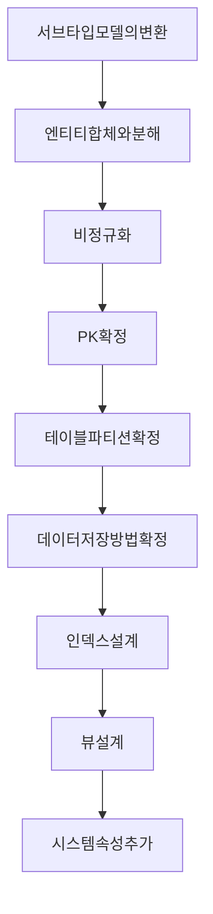

물리 모델의 주요 Flow를 살펴 보자.

### 목적
---

>논리 모델이 완료되면 모델 구조적인 측면에서 거의 모든 결정이 이루어짐. \
>물리 모델 단계에서는 모델 구조 보다는 물리적 요소에 대한 작업이 주로 이루어짐. \
>성능의 최적화를 목표로 한다. \

성능을 고려해 엔티티의 합체와 분해를 하기에 모델 구조가 변경될 수 있음.

데이터베이스에 구현되 데이터를 축적하며 app을 개발하는 실전 모델이 물리 모델임. 

고려해야 할 일은 크게 두가지임

1. ERD 차원 : 성능을 고려해 비정규화 하는것.
   엔티티 합체, 분해, 중복 추출 속성의 채택, 모델 변경 및 집계 엔티티 추가, 백업 복제 용도의 엔티티 추가
2. DBMS 차원 : 인덱스, 파티션, 클러스터, IOT, 뷰 등.

### 물리 모델의 주요 단계
---

### 서브타입 모델의 반환
---

슈퍼 타입과 서브 타입으로 구성된 모델은 통합과 분리에 대한 검토가 필요함.

서브 타입은 보통 핵심적인 엔터티에서 발생하므로 충분히 논의하고 결정 할 수 있도록 빠를수록 좋음.

### 엔티티 합체와 분해
---

일대일 관계의 두 엔티티를 하나의 엔티티로 합체 하는 것, 또는 하나의 엔티티를 두 개의 엔티티로 분해하는 것은 주로 성능 문제를 해결하기 위해 합체 또는 분해를 수행하게 됨.

엔터티의 합체,분해는 데이터를 중복 시키는 것이 아니므로 비정규화와는 다르고 합체, 분해가 발생하는 1:1 관계는 10회차에서 자세히 설명.

### 비정규화
---

주로 `데이터를 중복`시키는 방법으로 수행됨.

데이터 중복은 `아노말리` 현상을 초래해 데이터 무결성에 심각한 문제가 발생할 수 있으므로 , `도출된 특정 성능 문제를 해결`하기 위한 목적이 아니라면 `고려하지 않는게 좋음`.

물리모델링 단계가 아닌 더 이른 단계에서 수행할 수도 있으며, `정규화 수행후 성능 문제가 도출`되면 그 시점에서 `충분한 논의를 거쳐 비정규화 수행 가능`.

### PK 확정
---

논리 모델링 단계에서 확정된 `주 식별자`는 대부분 물리 모델에서 PK(Primry Key)가 됨.

주 식별자는 자신의 엔티티 뿐만 아니라 하위 엔터티에 미치는 영향이 크므로 가능한 `논리 모델링 단계`에g서 확정 하는 것이 좋음.

`상위 엔티티`에 대해서 `주 식별자`를 확정해 `PK`로 사용해야 하위 엔터티에서 미치는 파급 효과가 줄어듦.

파티션이나, 엔티티 합체,분해, 비정규화, 인덱스 효율성 등을 고려해서 약간의 조정을 거쳐 최종 PK 확정.

### 테이블 파티션 확정
---

성능관점, 관리측면, 가용성 측면을 고려해 확정.

파티션은 데이터 백업과도 연관되며, 파티션 적용 여부에 따라 백업 정책이 달라지고 모델이 변경 될 수 있음.

파티션 키에 따라 속성이 변경/추가 될수 있으며, 해당 엔터티와 관련된 업무를 알아야 정확하게 대응할 수 있음.

### 데이터 저장 방법 확정
---

가장 일반적인 방법은 데이터가 입력 되는 순서대로 저장.

성능을 고려해 특정 기준으로 유사값을 모아서 저장(클러스터링 테이블, IOT테이블)

### 인덱스 설계
---

실제 데이터와 SQL 구문이 존재 해야 하므로 물리 모델 단계에서 수행하는 것은 한계가 있기 때문에 물리 모델링 단계에서는 주로 식별자 위주로 선택한다.

`주 식별자, 외래 식별자, 후보 식별자 역할`을 하는 `속성`이 `인덱스의 1차 후보`가 됨.

하지만 결국 개발이 끝나고 엑세스 패턴을 분석, 또는 시스템 사용 빈도를 고려해 결정해야 함.

### 뷰 설계
---

실제 데이터와 SQL구문 실제 화면이 있어야 분석 설계 가능함.

시스템에서 뷰를 허용해준다면, 뷰의 사용으로 중복 데이터를 상당 부분 줄여 줄 수도 있음

### 시스템 속성 추가
---

전체 엔티티에 `공통`으로 추가되는 `시스템 속성`은 `최소한`으로 가져가는 것이 바람직함

가능하면 `업무적으로는 사용하지 않는것이 바람직함`

너무 많은 시스템 속성은 모델 관리가 불편하며 성능에 악영향을 줄 수있음

DBMS생성 직전에 추가 하는 것이 좋음(논리 모델링부터 시스템 속성이 존재한다면 관리 차원의 혼선 발생 가능성이 존재함)

다만, 논의는 빠를수록 좋음.