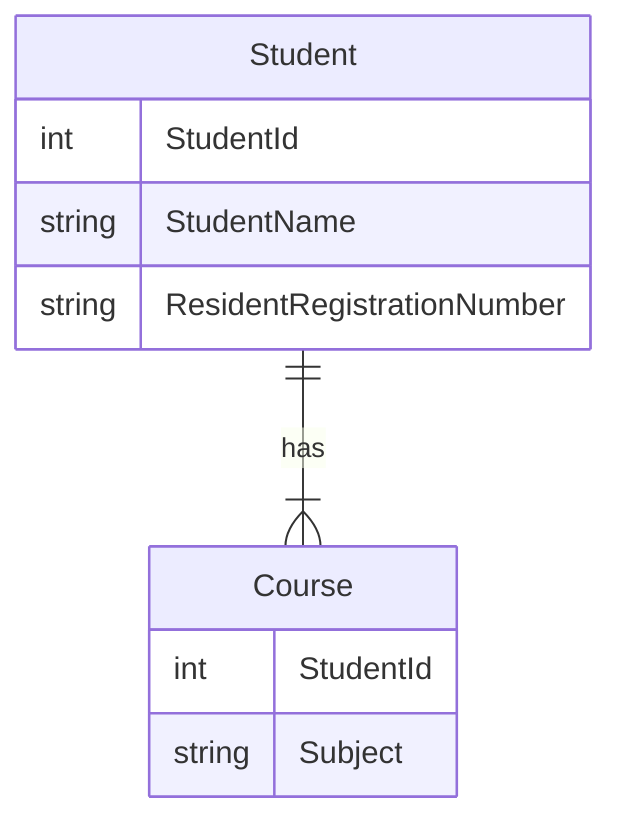

> 1정규형을 간단하게 설명하면 모든 속성은 반드시 하나의 값을 가져야 한다는 것.

같은 속성의 데이터를 여러 속성으로 나열해 관리하는 것과 같이 물리적으론 하나지만 논리적으로는 여러개의 값을 가지고 있는 케이스들이 존재함.

다가 속성(Multivalued Attributes), 복합 속성(Composite Attributes)를 알아야함.

### 다가 속성(Multivalued Attributes)
---

> 같은 종류의 값을 여러 개 가지는 속성을 의미.

여러 과목을 하위 릴레이션에서 관리하면 1정규형에 어긋남.

|학생 아이디|학생 이름|주민등록번호|과목|
|---|---|---|---|
|1|홍길동|123456-7890123|수학, 과학|
|2|이순신|234567-8901234|영어, 수학|
|3|김유신|345678-9012345|과학, 영어|

단일 값을 갖는 새로운 릴레이션이 필요함

|학생 아이디|학생 이름|주민등록번호|
|---|---|---|
|1|홍길동|123456-7890123|
|2|이순신|234567-8901234|
|3|김유신|345678-9012345|

|학생 아이디|과목|
|---|---|
|1|수학|
|1|과학|
|2|영어|
|2|수학|
|3|과학|
|3|영어|

모델로 표현하면

