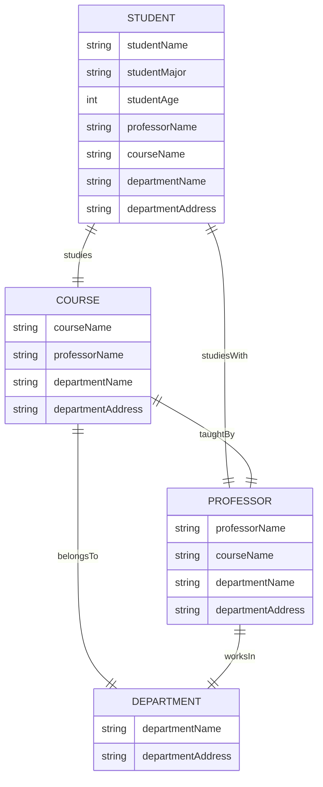
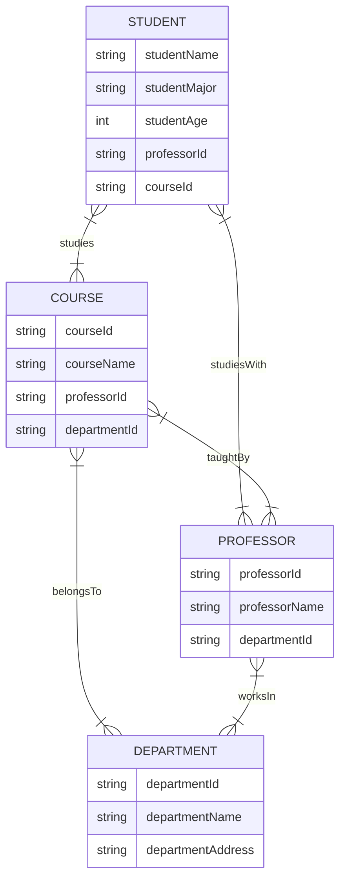

>정규화는 기본적으로 데이터를 이해 하는 과정이며, 정규화는 속성 간의 부정확한 종속성을 없애는 것을 의미 한다. \
> 함수 종속 개념을 기반으로 유사한 속성들은 모으고, 종속성이 없는 독립적인 속성은 분리하는 것이 정규화.

codd 형님이 관계형 데이터베이스 관련 글쓰고 보니까 데이터 중복에 대한 처리가 필요했고 1970년대에 정규화 라는 개념을 제시함

1정규형, 2정규형, 3정규형, 4정규형, BC 정규형, 5정규형 등이 존재함.

### 예제
---

> 책과 는 별개의 개별적인 정규화 과정에 대한 예제 추가.

이 구조에서는 각 테이블이 서로를 참조하고 있으며, 정보가 중복되어 있음.

`STUDENT 테이블`의 `professorName 속성`과 `PROFESSOR 테이블`의 `professorName 속성`은 같은 정보를 중복으로 저장하고 있음.

이와 같이 데이터베이스에 중복된 정보가 많으면, 한 정보가 바뀌었을 때 여러 테이블에서 동일한 정보를 업데이트해야 하는 문제가 발생.

이제 각 테이블은 중복된 정보를 가지고 있지 않고, 각각의 식별자를 이용하여 다른 테이블을 참조하도록 정규화.