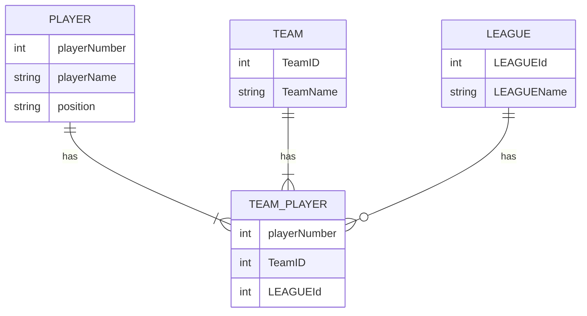

>아노말리(Anomaly)는 데이터 이상 현상임. \
>릴레이션에 존재하는 데이터에 의도하지 않은 이상 현상이 발생하는 것. \
>중복 데이터 때문에 발생함.

정규형 모델에서는 아노말리 발생이 최소화 되며 중복 데이터를 채택한 모델에서는 아래와 같은 아노말리가 발생한다.

1. **업데이트 아노말리(Update Anomaly)** : 릴레이션에서 속성 값을 `업데이트시` 발생하는 데이터 이상 현상.
2. **삭제 아노말리(Deletion Anomaly)** : 릴레이션에서 인스턴스 `삭제 시` 발생하는 데이터 이상 현상.
3. **삽입 아노말리(Addition Anomaly)** : 릴레이션에 새로운 인스턴스 `삽입 시`  발생하는 데이터 이상 현상.

### 예제
---

|#선수번호|선수이름|포지션|#팀ID|팀 이름|리그ID|리그 이름|
|---|---|---|---|---|---|---|
|1|Kim|포수|101|Tigers|201|KBO|
|2|Lee|투수|101|Tigers|201|KBO|
|3|Park|내야수|102|Bears|201|KBO|
|4|Choi|외야수|103|Lions|202|MLB|
|5|Yoon|포수|103|Lions|202|MLB|

"#" 은 주 식별자를 의미한다

**삽입 이상(Insertion Anomaly)**

새로운 선수를 추가하려고 하는데, 그 선수가 속한 팀의 정보나 리그의 정보가 `아직 결정되지 않았다면`, 해당 선수의 정보를 삽입할 수 없다.

팀ID가 주 식별자 이며 `주 식별자는 null 값을 가지지 못하기 때문`이다.

**갱신 이상(Update Anomaly)**

특정 팀의 이름이나 리그의 이름이 변경되었을 때, 해당 팀이나 리그에 속한 `모든 선수의 정보를 갱신`해야 함. 

>릴레이션 갯수가 많고 인스턴스 갯수가 수천만 건이 될시 업데이트해야 할 엔티티가 많다면 문제가 될 수 있으며 업데이트할 속성이 여러 엔티티에 존재하면 완벽한 업데이트는 쉬운 일이 아님.

정규화를 하여 중복을 제거하면, 중복 데이터가 없어 업데이트를 부분적으로 할 수 없고 하나만 업데이트하면 전체가 업데이트 되므로 관리가 훨씬 수월함.

**삭제 이상(Deletion Anomaly)**

`특정 선수를 삭제`하면, 그 선수가 `속한 팀`이나 `리그`의 유일한 정보가 삭제될 수 있음. 

이는 필요한 정보를 잃게 되는 문제를 야기할 수 있음.

정규화가 돼 `릴레이션이 분해`되면 원하는 `선수 데이터만 삭제`할 수 있음.

### 정규화 해서 변경한 예제
---

>문제는 소수의 데이터이며 1000만건의 데이터 중 10여건만 틀려도 데이터는 신뢰하지 못하게 됨. \
>위 문제가 된 릴레이션은 선수와 팀 등 몇 개의 릴레이션을 조인한 뷰와 같음. \
>하나의 주제로만 이루어진 `세 개의 릴레이션을 조인하면 얻을 수 있는 결과`를 `하나로 합쳐서 저장`했으므로 다양한 아노말리가 발생하는 것.

위와 같아 하나의