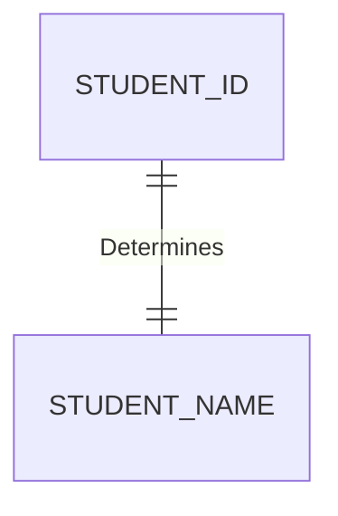
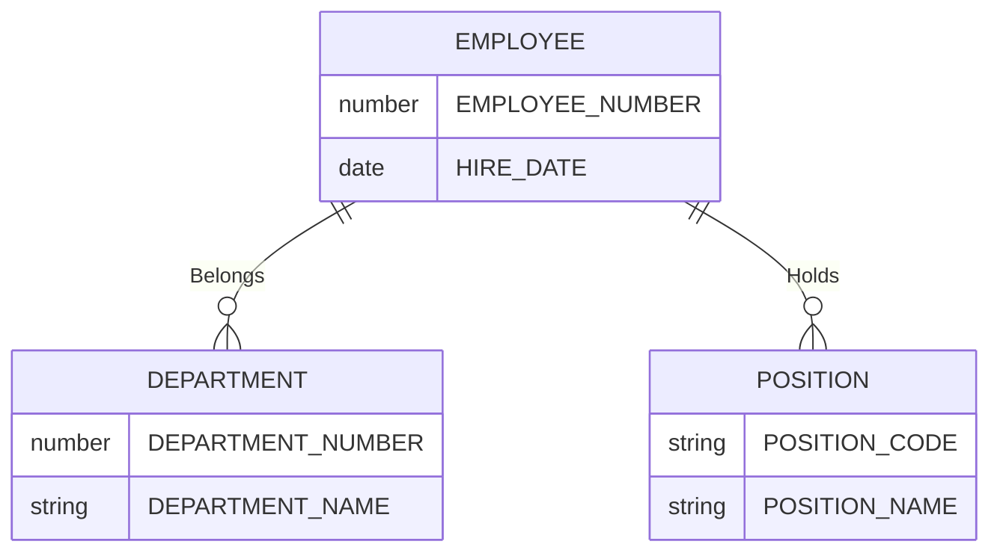
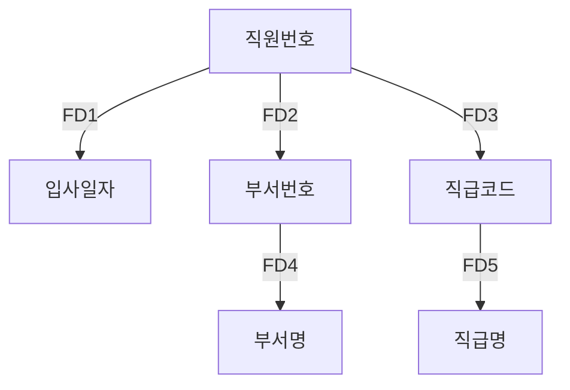

> 관계형 데이터 베이스 모델을 설계할 때 가장 중요한 데이터 종속성임.

데이터 종속성에는 3가지 종속이 존재
1. 함수 종속(Functional Dependency)
2. 다가 종속(Multivalued Dependency)
3. 3.조인 종속(Join Dependency)

여기서 함수 종속은 엔티티 내 존재하는 속성 간의 종속성을 의미.

>엔티티 내에서 한 속성 또는 속성 그룹의 값이 다른 속성 또는 속성 그룹의 값을 유일하게 결정할 수 있는 관계를 말함. \
>이때 값을 결정하는 속성 또는 속성 그룹을 **결정자(Determinant)**, 결정되는 속성 또는 속성 그룹을 **종속자(Dependent)** 라고 함.

### 결정자(Determinant) / 종속자(Dependent)
---

**결정자** 

속성 간의 종속성을 규명할 때 **기준이 되는 값** 또는 그룹.

**종속자**

결정자의 **값에 의해 정해지는 값** 또는 그룹.

속성 Y가 속성X에 의해 함수적으로 종속된다는 말은 속성 X의 값을 이용해 속성 Y의 값을 유일하게 식별할 수 있다는 의미

학번은 학생 이름으로 결정하기 때문에 함수 종속 관계를 나타냄.

하지만 `학생 이름은 동일한 이름을 가진 학생이 존재` 할 수 있으므로 학생 이름은 학번을 `결정하진 못함`.

즉 학번은 `결정자` 이며 학생 이름은`종속자`임

결정자 X의 값은 반드시 하나의 Y값과 연관되며 X 값에 의존하는 Y 값은 하나뿐이지 다른 Y 값이 있을 수 없다.

이떄 X 는 Y를 함수적으로 결정한다고 하며 기호로는 아래와 같다

1. X → Y
2. Y = F(X)
3. X : 결정자(Determinant), Y : 종속자(Dependent)

`학번`은 `학생 이름`을 `함수적으로 결정`한다 또는 `유일하게 결정`한다 라고 말할 수 있다.

반대 는 성립되지 않으며 이와 같이 `반례를 하나만 찾아도 함수 종속이 성립하지 않는 다는 것을 입증`할 수 있다.

## 함수 종속 사례

> 책과는 다른 별도의 예제로 작성

직원번호, 입사일자, 부서번호, 직급코드, 직원명, 직급명으로 구성된 엔터티에서 함수 종속(FD) 도출

- FD1 : 직원번호 → 입사일자
- FD2 : 직원번호 → 부서번호
- FD3 : 직원번호 → 직급코드
- FD4 : 부서번호 → 부서명
- FD5 : 직급코드 → 직급명

위와 같음 즉 `직원번호`를 알면 `입사를 언제 했는지`(FD1), `부서가 어딘지`(FD2), `직급이 어떻게 되는지`(FD3)를 알 수있음.

마찬가지로 `부서 번호`를 알면 `부서 이름`이 뭔지(FD4), 직급 코드를 알면 `직급`이 뭔지를 알 수 있음(FD5)

X → Y와 같이 속성 간의 종속 관계 발생 시, X와 Y는 항상 함께 존재해야 하며, 결정자는 엔터티의 주 식별자가 됨

엔티티1 : "#"직원번호, 입사일자, 부서번호, 직급코드

엔티티2 : "#"부서번호, 부서명

엔티티3 : "#"직급코드, 직급명

### 또 다른 표현 법.
---

위의 함수 종속 FD1, FD2, FD3 를 FD6과 같이 표현 가능.

FD6 : 직원번호 -> (입사일자, 부서번호, 직급코드)

또한 여러 속성이 결정자가 되면 FD7 과 같이 표현 가능.

FD7: (직원번호, 직급코드) -> 직급명으로 

### 역으로 분리하는 경우.
---

FD6은 FD1, FD2, FD3으로 분리 가능

FD7은 FD8, FD9로 `분리 불가`

FD7의 경우 `직원번호`와 `직급코드`의 결합이 `직급명`을 `유일하게 결정`한다는 것임.

`직원번호` 혹은 `직급코드` 단독으로 `직급명`을 유일하게 결정할 수 없음.

왜냐하면 `직원번호`와 `직급코드`의 결합이 없이는 `동일한 직급명`이 여러개 있을 수 있기 때문.

즉, `직원번호`와 `직급코드`의 결합이 없이는 `직급명을 유일하게 식별`할 수 없음.

### 직접, 간접 속성
---

X → Y → Z 종속이 있을 경우, Z는 X에 간접종속이 되는데 이 경우 Z는 X에 간접적으로 종속돼 있다.

이 경우, X, Y, Z를 하나의 엔티티에 포함시키는 것보다는,` X, Y를 하나의 엔터티`, 그리고 `Y, Z를 다른 엔터티`로 `분리`하는 것이 더 바람직함.

X → Y → Z 와 같은 종속을 `이행 종속(Transitive Dependency)`이라 하며, 3정규형과 관련된 종속.

함수종속은 일반적으로 어떤 속성이 다른 속성을 직접 결정하는 경우인 `직접 종속`을 의미함

>함수 종속은 키와 밀접한 연관이 있으며 `함수 종속의 결정자가 키가 되도록 릴레이션을 분해`하는 과정이 정규화 임. \
>즉 `키가 아닌 모든 속성`이 `키`에 직접 `종속`되도록 `분해`하는 것이 `정규화`임.

### [[폐포(Closure)]]
---
>릴레이션 R의 속성 X가 키인지 아닌지 알려면 X의 폐포 즉 클로저를 알아야 한다. \
>클로저에 대해서는 위 링크를 참조.

### 정규형 도출 
---

**릴레이션의 키를 도출한 뒤 2정규화 3정규화를 수행한다**

클로저를 알아야 하고 클로저를 구하려면 그 릴레이션에 존재하는 모든 함수 종속을 알아야함.

모든 함수 종속을 알기 힘들기 때문에 클로저를 엄격하게 적용하지 않으면서 후보키를 찾고 함수 종속을 찾으면서 정제해 나가는 방법을 사용.

